# cf-arb-bot — tour de arquitetura

Um tour guiado por cada módulo que o bot toca, **na ordem em que um único frame de market data
flui através deles**, do byte do WebSocket no wire até uma linha no journal em disco.

- **[`README.md`](README.md)** — o "porquê", o setup e o checklist de ir para live. Comece por
  lá; este documento é o aprofundamento para o qual ele aponta.
- **[`CLAUDE.md`](CLAUDE.md)** — os inegociáveis de segurança e os gaps documentados.
- **[`Architecture-tour.md`](Architecture-tour.md)** — this same document in English.

Este arquivo é o "o que acontece, em que ordem, em qual classe". Onde o código em execução faz
algo sutilmente diferente do que um javadoc ou o README diz, há uma **⚠ Nota**; elas estão
reunidas no fim, em
[Discrepâncias e ressalvas](#discrepâncias-e-ressalvas-encontradas-ao-escrever-isto).

Verificado contra a `main` no commit `a6deefb` (o merge do third-pass review — PR #1). Os
diagramas são Mermaid — renderizam no GitHub e na maioria dos visualizadores de Markdown. Cada
seção tem um.

## O pipeline inteiro num relance

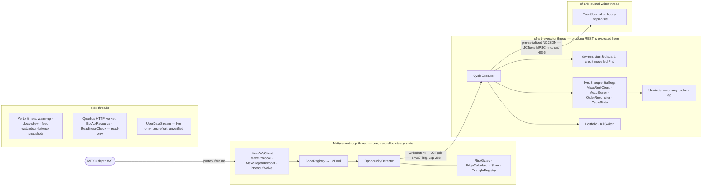

---

## Estágio 0 — Inicialização e montagem: `BotService`

`io.cfarb.BotService` é `@ApplicationScoped`; tudo acontece em `onStart(@Observes StartupEvent)`.
É o único lugar onde o grafo de objetos é montado (apenas `BotConfig`, `Vertx` e `BotMetrics` são
injetados por CDI). A ordem de construção importa — objetos posteriores dependem dos anteriores.

```mermaid
flowchart TD
    A["logStartupSafetyBanner()<br/>DRY-RUN banner / loud LIVE warning (S4)"] --> B
    B["loadFilters() → SymbolFilterLoader<br/>cf-bot.filters-path or classpath mexc_filters.json"] --> C
    C["BookRegistry — one L2Book per symbol<br/>WARMUP_UPDATES=50, WARMUP_SECONDS=30"] --> D
    D["TriangleRegistry — Triangle[] + int[][] trianglesBySymbol<br/>validates each triangle chains &amp; closes at the anchor"] --> E
    E{"dryRun?"}
    E -->|no| E1["validateOrderType(filters)<br/>every leg must advertise LIMIT; IOC/FOK → loud WARN"]
    E -->|yes| F
    E1 --> F
    F["seed-usd &gt; 0 &amp; equity-floor-usd &gt; 0, else throw"] --> G
    G["Portfolio(seed) → KillSwitch(floor, maxConsecutiveFailures) → RiskGates<br/>RiskGates clamps max-notional-usd to $1000 (S6)"] --> H
    H["EventJournal.start() — spawns cf-arb-journal-writer"] --> I
    I["wireKillSwitchTripListener() + killSwitch.checkEquityFloor() (before the feed connects)"] --> K
    K["SpscArrayQueue&lt;OrderIntent&gt;(256)"] --> L
    L["OpportunityDetector(... rejectSampleMs)"] --> M
    M["MexcRestClient — BOTH modes<br/>dry-run: dummy signer, never sends. live: MEXC_API_KEY/SECRET from env (S1)"] --> Nn
    Nn{"dryRun?"}
    Nn -->|no| N1["Unwinder + UserDataStream.start()"]
    Nn -->|yes| O
    N1 --> O
    O["CycleExecutor.start() — spawns cf-arb-executor"] --> Pp
    Pp["MexcWsClient.start() with MexcProtocol.subscribeMessages(...)"] --> Q
    Q["3 Vert.x periodic timers: warm-up+clock-skew, feed watchdog, latency snapshots"]
```

`onStop(@Observes ShutdownEvent)` para, nesta ordem: ws client, executor, user-data stream,
journal.

**Mudança do third pass:** o construtor do detector agora também recebe
`config.journal().rejectSampleMs()` (padrão 1000 ms) — ver Estágio 4.

---

## Estágio 1 — O socket de market data: `feed.MexcWsClient` (+ `feed.MexcProtocol`, `util.ByteScan`)

**Uma** única conexão WebSocket carrega todos os 9 símbolos (a MEXC limita a 30 streams por
conexão). O scaffolding (opções de WS, backoff exponencial com teto, remontagem de frames
fragmentados, rastreio de reconnect-churn) foi portado do `recorder-service`; o tratamento do
payload foi reescrito para decodificar in-place.

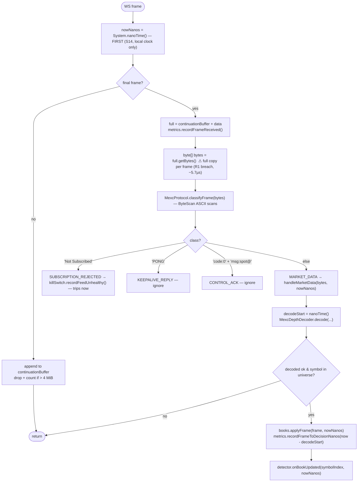

- **`connect()`**, ao ter sucesso, registra `frameHandler`, um exception handler e um
  `closeHandler` que coloca `connected=false`, cancela o keepalive, chama **`books.resetAll()`** e
  agenda um reconnect. Ele também chama `books.resetAll()` *de novo* logo antes de re-subscrever,
  então envia as mensagens de `SUBSCRIPTION` e inicia um timer de keepalive de 20 s
  (`{"method":"PING"}`).
- **`MexcProtocol.subscribeMessages`** transforma `aggre.depth@10ms` em
  `spot@public.aggre.depth.v3.api.pb@10ms@%s`, agrupado em lotes de ≤30 símbolos por mensagem. Seu
  javadoc registra a regra: `increase.*` / `bookTicker` puro são silenciosamente bloqueados pela
  MEXC — nunca adicione um channel sem um probe ao vivo.
- **Helpers de health**: `forceReconnect()` (fecha o socket para rodar o caminho normal de
  recuperação), `isChurning()` (≥5 conexões numa janela deslizante de 5 min, podada também na
  *leitura*), `isConnected()`. `recentConnectMillis` é `synchronized` (lido pelo HTTP worker).

> ⚠ **Nota.** `recordFrameToDecisionNanos` cobre **apenas decode + `BookRegistry.applyFrame`** —
> para *antes* de `detector.onBookUpdated`, e começa *depois* da cópia `getBytes()` e de
> `classifyFrame`. O `frameToDecisionUs` de `/api/v1/latency` é "decode+apply", não "wire até a
> decisão de fire".

---

## Estágio 2 — Decode: `feed.MexcDepthDecoder` + `feed.ProtobufWalker` (+ `util.FixedPoint`)

Sem `.proto`, sem `protoc`, sem `protobuf-java` (R11); estritamente iterativo (S8); zero alocação
no steady path (R1).

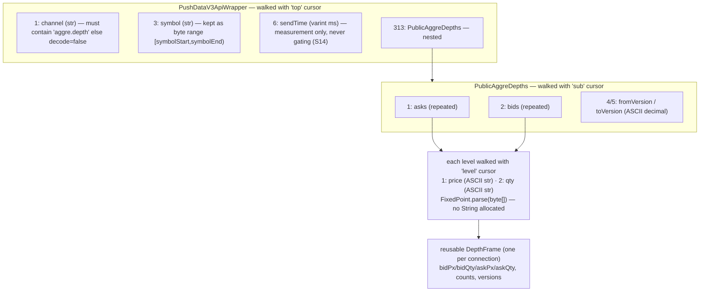

- **`ProtobufWalker`** — um walker genérico de tag/length sobre `byte[]`. Um `Cursor` reutilizável
  por nível de aninhamento (`topCursor`, `subCursor`, `levelCursor`, alocados uma vez em
  `MexcWsClient`). Campos length-delimited expõem `[lenStart, lenEnd)` **como um range dentro do
  buffer original**. Qualquer truncamento / varint inválido / wire type não suportado coloca
  `cursor.malformed = true` e retorna `false` — sentinel fail-closed, sem exception no hot path
  (R14).
- Níveis além de `MAX_LEVELS = 50` são silenciosamente descartados (subestimando a profundidade —
  a direção segura). Um nível individual malformado é descartado sem envenenar o frame; uma
  *estrutura* malformada retorna `false`. `decode` → `false` significa "não é um frame de depth",
  nunca um erro.
- Verificado contra 8 frames reais capturados (`src/test/resources/fixtures/mexc_depth_*.pb.bin`,
  oracle do decoder Python) em `MexcDepthDecoderTest`.

**`FixedPoint`** (fixed-point de 1e8) também carrega:

- **`mulDiv(a,b,c)`** — o teste de overflow é `Math.multiplyHigh(a,b) != (low >> 63)`.
  **Mudança do third pass (NEW-6):** o ramo de overflow não aloca mais `BigInteger` — um único
  nível de top-of-book do tamanho de BTCUSDT já estoura o fast path de `long` puro, então o
  `levelNotional` de `Sizer.fillAsk` batia nele em praticamente todo ladder walk de par major *na
  Netty thread* (uma violação real de R1). Para operandos não negativos (todo caller real) ele
  agora usa uma divisão de bits unsigned 128÷64 sem alocação (`divideUnsigned128by64`),
  cross-checada contra `BigInteger` sobre 100k triplas aleatórias em `FixedPointTest`. Operandos
  negativos ainda caem no `BigInteger`.
- **`quantizeDown`** (piso de lot-size), **`toPlainString`** (decimal puro, **trunca** — nunca
  arredonda, nunca notação científica, que o endpoint de order da MEXC rejeita).

---

## Estágio 3 — Estado do book: `book.BookRegistry` + `book.L2Book`

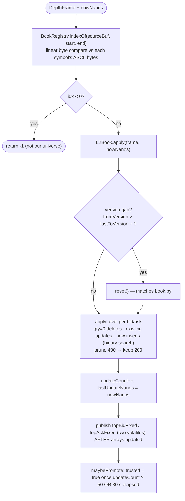

- **`BookRegistry`** — array flat indexado pela posição em `cf-bot.symbols` (R3). `resetAll()` a
  cada disconnect + de novo antes de re-subscrever.
  **Adições do third pass:** os accessors `isTrusted(symbolIndex)` e `ageNanos(symbolIndex, now)`,
  lidos cross-thread pelo `Unwinder` para seu novo gate de staleness no pricing de reversal
  (Estágio 8).
- **`L2Book`** — um símbolo, **não thread-safe por design** (a Netty thread é a única escritora).
  Arrays primitivos ordenados (bids desc, asks asc, `CAPACITY = 512`). Predicados de health:
  `isTrusted()`, `isCrossed()` (`bestBid >= bestAsk`), `isEmpty()` (um dos lados vazio),
  `ageNanos(nowNanos)`. `topBidFixed`/`topAskFixed` são publicados *depois* de os arrays de níveis
  serem atualizados, e lidos cross-thread apenas pelo `Unwinder` (a exceção declarada do
  inegociável #5 do CLAUDE.md; uma leitura "torn" ali é inofensiva).

> ⚠ **Nota.** `L2Book.apply` retorna um boolean de version-gap "para o caller poder contar", mas
> `BookRegistry.applyFrame` descarta esse retorno e nada conta os gaps. O `reset()` no gap ainda
> dispara.

---

## Estágio 4 — Detecção: `strategy.OpportunityDetector`

Roda **inline na Netty thread** logo após o book update. Zero alocação até um fire de verdade.

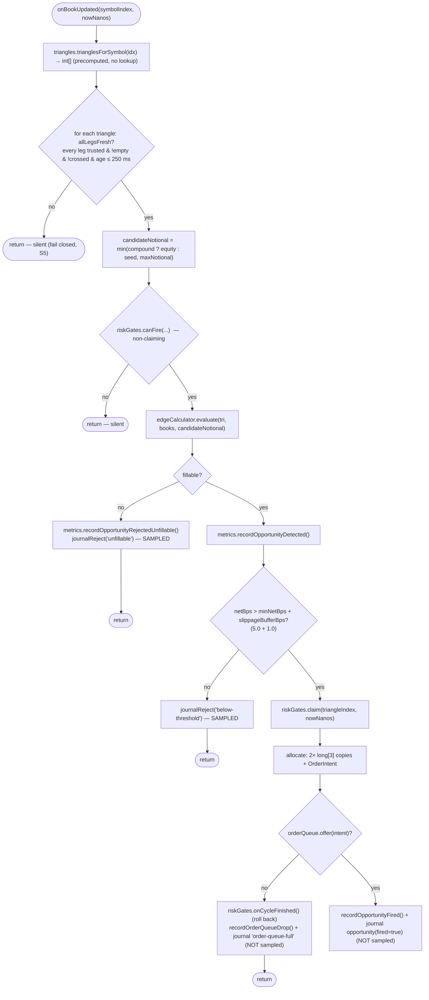

**Mudança do third pass — o stream de rejects agora é amostrado.** Todo candidato que passa dos
gates baratos chega a um caminho de reject, e o cooldown por-triângulo de `canFire` só avança num
`claim` de verdade, então um triângulo que nunca dá fire estava escrevendo uma linha de journal (e
uma alocação de `String`, na Netty thread — violação de R1) a *cada* book update que tocava nele:
~900 linhas/s, ~10 GB/dia, o suficiente para encher o volume raiz de 20 GB do deploy em ~2 dias de
**dry-run**.

`journalReject(...)` agora escreve no máximo uma linha por triângulo por
`cf-bot.journal.reject-sample-ms` (padrão 1000). Rejects suprimidos são **contados** como
`cfarb.journal.suppressed` (nunca descartados silenciosamente). **Fires e `order-queue-full` nunca
são amostrados** — são raros por construção e são o que um operador usa para reconstruir uma
sessão. O `lastRejectJournalNanos[]` por-triângulo é semeado com `Long.MIN_VALUE/2` para que o
*primeiro* reject de cada triângulo sempre vá para o journal.

> ⚠ **Nota.** O javadoc da classe ainda diz "um `OrderIntent` é alocado" num fire; o código aloca
> três objetos ali (o intent + duas cópias `long[3]`). Ainda assim, só no ramo raro.

### Estágio 4a — Gates: `risk.RiskGates`

Single-writer (Netty thread) para o array de cooldown e o ring de cycles/minute; só `openCycles` e
os campos do kill switch cruzam threads.

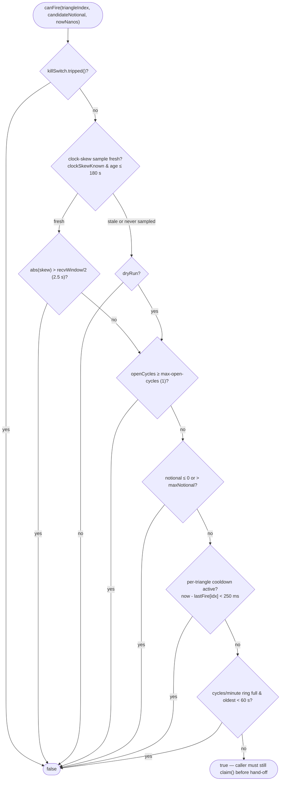

**Mudanças do third pass (M7):**
- **Tolerância de clock-skew reduzida pela metade** — do `recvWindow` inteiro (exatamente o limite
  `-1021` da MEXC, "timestamp outside recvWindow", margem zero) para `recvWindow / 2`. O
  `recvWindow` em si não muda no wire.
- Amostras de clock-skew agora **expiram.** `clockSkewKnown` travava `true` para sempre na
  primeira amostra bem-sucedida. Agora `updateClockSkew` também registra `clockSkewSampleNanos`, e
  uma amostra mais antiga que `CLOCK_SKEW_SAMPLE_MAX_AGE_NANOS` (180 s = 3× a cadência de
  amostragem de 60 s) é tratada exatamente como "nunca amostrado" → fail closed em live mode.
  Assim, uma perda posterior de rota para `/api/v3/time` degrada o gate de volta ao seguro em vez
  de confiar num valor de horas atrás.

`claim(...)` carimba o slot de cooldown, empurra o timestamp no ring,
`openCycles.incrementAndGet()`. `onCycleFinished()` → `openCycles.updateAndGet(n -> max(0, n-1))`.
`max-notional-usd` / `max-open-cycles` / `max-cycles-per-minute` não positivos **lançam exceção na
construção**.

### Estágio 4b — Matemática de edge: `strategy.EdgeCalculator` + `strategy.Sizer`

CLAUDE.md #7: "a única peça que precisa estar exatamente certa." Cross-checada contra
`cf-arb-poc/cfarb/stage2_cycles.evaluate_cycle` em `EdgeCalculatorTest`; o `Sizer` também tem seu
próprio `SizerTest` (adicionado no third pass).

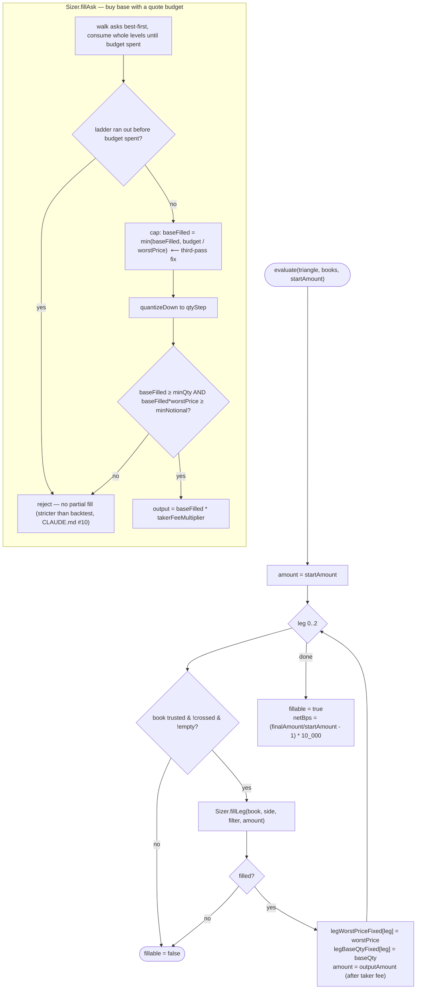

**Correção do third pass (`fillAsk`):** `baseFilled` é acumulado pelos níveis do ladder ao preço
*próprio* (melhor) de cada nível, então `baseFilled × worstPrice` podia exceder o budget num walk
multi-nível — mas o executor submete **uma** ordem IOC limit para a quantidade inteira *ao*
`worstPrice`, e o balance check da MEXC avalia a ordem a esse limit price, não ao VWAP. `fillAsk`
agora limita a quantidade para que o notional ao worst price nunca exceda o budget: conservador
(nunca ordena mais que o modelado), no-op quando um único nível satisfaz o tamanho.

`fillBid` (vender base por quote): quantiza a base em mãos para baixo primeiro; rejeita se
`< minQty`; caminha os bids best-first; rejeita se a profundidade exibida não cobre o tamanho ou
`quoteReceived < minNotional`. `worstPriceFixed` (último preço do ladder tocado) é o limit price
IOC marketable que o executor pede — então um book que se moveu contra nós produz um fill
parcial/nulo (→ `Unwinder`), nunca um fill *pior que o computado*.

---

## Estágio 5 — O hand-off: `model.OrderIntent` + a SPSC queue

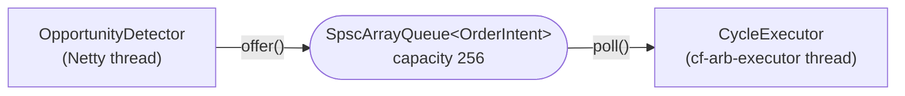

`SpscArrayQueue<OrderIntent>` (JCTools, cap 256) — um dos **três hand-offs de thread declarados**
(CLAUDE.md #5): detector→executor, o journal writer e o user-data stream live. Um quarto exige
primeiro uma mudança no doc de plano.

**`OrderIntent`** (record): `detectedAtNanos`, `triangleIndex`, `candidateNotionalFixed`,
`detectedNetBps`, `legWorstPriceFixed[3]`, `legBaseQtyFixed[3]`. O executor submete a base qty da
leg 0 **literalmente**; as legs 1–2 re-derivam o tamanho a partir dos proceeds *reais* da leg
anterior, mas precisam cair na mesma quantização.

---

## Estágio 6 — Execução: `exec.CycleExecutor`

Thread daemon própria, `cf-arb-executor`. REST bloqueante aqui é esperado (R5/Q4).

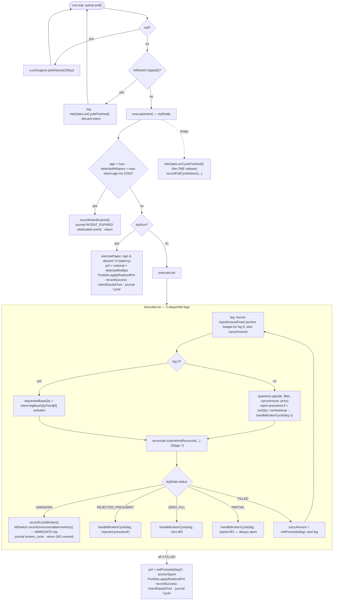

**Mudanças do third pass:**
1. **`CycleState.Leg.inputAmountFixed`** — cada leg registra *o que recebeu* (budget de anchor
   para a leg 0, `carryAmount` para as legs 1–2) **antes da submissão**, para que o `Unwinder`
   possa carregar o resto não gasto de um fill PARTIAL para trás em vez de abandoná-lo (Estágio 8).
2. **Intent stale** → `JournalEvents.intentExpired(...)` — um evento `intent_expired` **dedicado**,
   não o formato de `brokenCycle` com um sentinel `failed_leg=-1` (que inflava a contagem de linhas
   de broken-cycle no NDJSON enquanto `cfarb.cycles.broken` deliberadamente não era incrementado,
   deixando o journal e o counter do Prometheus permanentemente em desacordo).
3. **Status de leg `UNKNOWN`** → `killSwitch.recordUnrecoverableInventory(...)` — **trava
   imediatamente**, conforme o contrato de `CycleState.LegStatus.UNKNOWN`. Antes chamava
   `recordFailure` (3 strikes), então entre o 1º e o 3º `UNKNOWN` o Portfolio ficava sem débito
   enquanto a conta talvez já segurasse inventário non-anchor da primeira leg ambígua.

**`handleBrokenCycle`**: `recordCycleBroken()` → `unwinder.unwind(triangle, state, failedLeg)` →
`loss = recoveredAnchorFixed - anchorSpent` (ambos denominados no anchor) → `applyBrokenCyclePnl(loss)`
se não zero → `unrecoverable` ? `recordUnrecoverableInventory` (imediato) : `recordFailure`
(conta para o trip de 3 seguidos) → `checkEquityFloor` → journal `broken_cycle`.

> ⚠ **Nota.** `decisionToLeg1AckNanos` é registrado uma vez **por leg** (as três), cada um cobrindo
> o round trip inteiro `place → query → cancel? → trades`, misturados num só histograma. Gap
> conhecido de Tier-3 (CLAUDE.md). O sign-and-discard do dry-run também fixa `type=LIMIT` enquanto
> uma ordem live usa `IOC` — inofensivo (nada é enviado), mas os bytes assinados diferem um pouco.

---

## Estágio 7 — I/O de ordens assinadas: `exec.MexcRestClient`, `exec.MexcSigner`, `exec.OrderReconciler`, `exec.CycleState`

A MEXC **não tem API de order-entry por WebSocket** — colocar ordens é só REST.

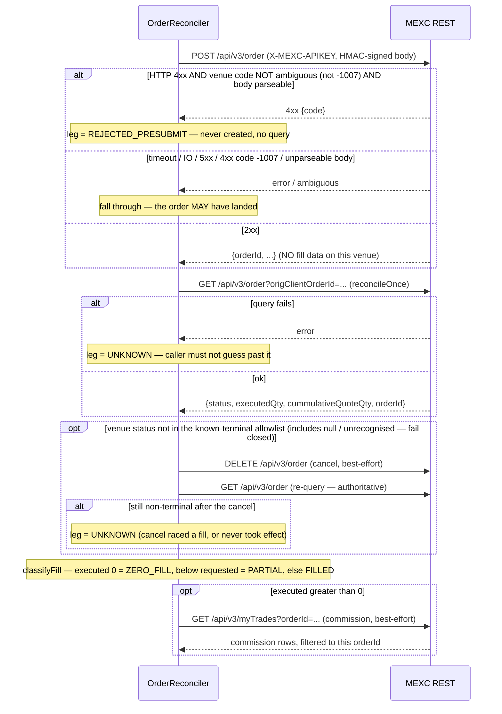

- **`MexcRestClient implements MexcOrderApi`** — um `WebClient` Vert.x, `keepAlive`, sem
  pipelining, `maxPoolSize=4`. `warmUp()` → `GET /api/v3/ping` (mantém o socket do pool vivo nos
  gaps ociosos); `serverTime()` → `GET /api/v3/time`. Não-2xx → `OrderRejectedException(statusCode,
  body)` (nunca loga a request/assinatura — S3). `sign(query)` — monta + assina, retorna, **o
  caller descarta** (caminho de latência do dry-run).
- **`MexcSigner`** — HMAC-SHA256, hex minúsculo, `keySpec` sobre os bytes do secret; nunca uma
  `String` visível como campo, nunca logado. Verificado em `MexcSignerTest` contra um vetor de
  referência de `hmac`/`hashlib` do Python.
- **`OrderReconciler`** (package-private, compartilhado por `CycleExecutor` e `Unwinder`).
  `netProceeds(side, filter, leg)` = proceeds no *to-asset* da leg, menos a commission **confirmada**
  por fill quando ela está no asset recebido, senão `raw × takerFeeMultiplierFixed`.

**Mudanças do third pass (M4/M5/M6):**
- **Nem todo HTTP 4xx é definitivo.** O código de venue `-1007` ("send status unknown; execution
  status unknown") é o sinal de ambiguidade da *própria* MEXC e pode chegar atrás de um 4xx de um
  edge proxy/WAF. `isAmbiguousRejection(body)` — só uma resposta cujo `code` de venue está *fora*
  do conjunto ambíguo pula a reconciliação; um body que nem dá para fazer parse **fail closed** e
  vai para a reconciliação.
- **`isNonTerminal` virou um allowlist explícito de status terminais** (`KNOWN_TERMINAL_STATUSES`).
  Qualquer coisa fora dele — `NEW`/`PARTIALLY_FILLED` conhecidos como resting, um `status`
  *ausente*, ou um valor não reconhecido — agora dispara o caminho de cancel-and-verify (antes era
  fail-*open*).
- **Um cancel que não limpou a ordem não é mais confiado.** Se a re-query pós-cancel ainda
  reporta não-terminal, a leg é `UNKNOWN`, não entra em `classifyFill`.

**`CycleState`** — de propriedade da executor thread, um por tentativa. `LegStatus` por-leg
(`PENDING`, `FILLED`, `PARTIAL`, `ZERO_FILL`, `REJECTED_PRESUBMIT`, `UNKNOWN`), `inputAmountFixed`
(novo), base+quote pedido/executado, `venueStatus`, `venueOrderId`, campos de commission.

---

## Estágio 8 — Recuperação: `exec.Unwinder`

CLAUDE.md: "o maior risco de engenharia deste build." Reescrito por três review passes
independentes. `UnwinderTest` (agora ~15 testes) + `CycleExecutorTest` exercitam isto.

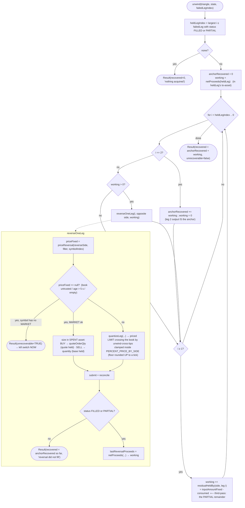

**Como o walk funciona** (execução estritamente sequencial → no máximo o output de uma leg está
"em mãos" — *mais*, desde o third pass, o input não gasto de qualquer fill PARTIAL):

1. **Held leg** = maior `i ≤ failedLegIndex` com status `FILLED`/`PARTIAL`.
   - **Nenhuma** → nada adquirido, nada gasto.
   - **Leg 2** → seus proceeds *estão* denominados no anchor (invariante de fechamento do
     triângulo) → depositados em `anchorRecovered`; o walk ainda desce pelas legs 1 e 0 para pegar
     um **resto não vendido da leg 1 de um PARTIAL na leg 2**.
   - **Caso contrário** → reverter a leg `i` (side oposto, dimensionado ao que foi adquirido),
     depois as legs `i-1 … 0`, cada passo gastando os proceeds reais da reversal anterior. Após a
     reversal da leg 0 o valor está denominado no anchor.
2. **`residualHeldBy(side, leg)` = `inputAmountFixed - consumed`** (uma leg ASK gasta quote /
   `cummulativeQuoteQty`, uma leg BID gasta base / `executedQty`) — carregado para trás nas legs
   `≥ 1`. **A leg 0 é excluída**: seu from-asset é o anchor, seu resto não consumido nunca foi
   gasto, e `CycleExecutor.anchorSpent` já mede o gasto real da leg 0 (somá-lo contaria em dobro
   como lucro).
3. **Pricing da reversal — `priceReversal`**: recusa precificar (→ `null` → MARKET/stranded) se o
   book está untrusted, **mais velho que `MAX_REVERSAL_PRICE_AGE_NANOS` (5 s)**, ou não tem top no
   lado necessário. Senão, cruza o top atual por `cf-bot.exec.unwind-cross-bps` (40) e
   `clampToPriceBand` dentro de `PERCENT_PRICE_BY_SIDE`. **O floor é arredondado PARA CIMA para um
   tick representável primeiro**, para que a truncagem posterior no wire (`toPlainString` nunca
   arredonda) não empurre o preço submetido *abaixo* do floor real do venue.
4. **O fallback de MARKET é dimensionado no asset que está sendo GASTO**: um SELL carrega
   `quantity` (base em mãos); um **BUY carrega `quoteOrderQty`** (quote em mãos) e **nenhum
   `quantity`**. A primeira versão alimentava um preço placeholder de `1.0` em `quantizeLeg` para
   ambas as direções — no-op para um SELL, mas erro de moeda para um BUY, transformando ~100 USDC
   em mãos num `MARKET BUY 100 BTC` em `usdt-btc-usdc-fwd`. `quoteOrderQty` é **não verificado
   contra a MEXC** (mesmo status de `IOC`); ele fail safe — um parâmetro não suportado gera um 4xx
   que cai em `REJECTED_PRESUBMIT` ("stranded, operator review"), nunca uma ordem mal dimensionada.
5. Sem fonte de pricing **e** sem `MARKET` (`ETHUSDC`/`SOLUSDC`/`XRPUSDC`) → `Result(unrecoverable =
   true)` → `KillSwitch.recordUnrecoverableInventory` (imediato). Valor em mãos abaixo do mínimo do
   venue, ou uma reversal que não dá fill → `Result` com o anchor depositado até então e um detalhe
   "STRANDED, operator review required" (`unrecoverable = false` — conta para o trip ordinário).

---

## Estágio 9 — Contabilidade e o kill switch: `state.Portfolio`, `risk.KillSwitch`

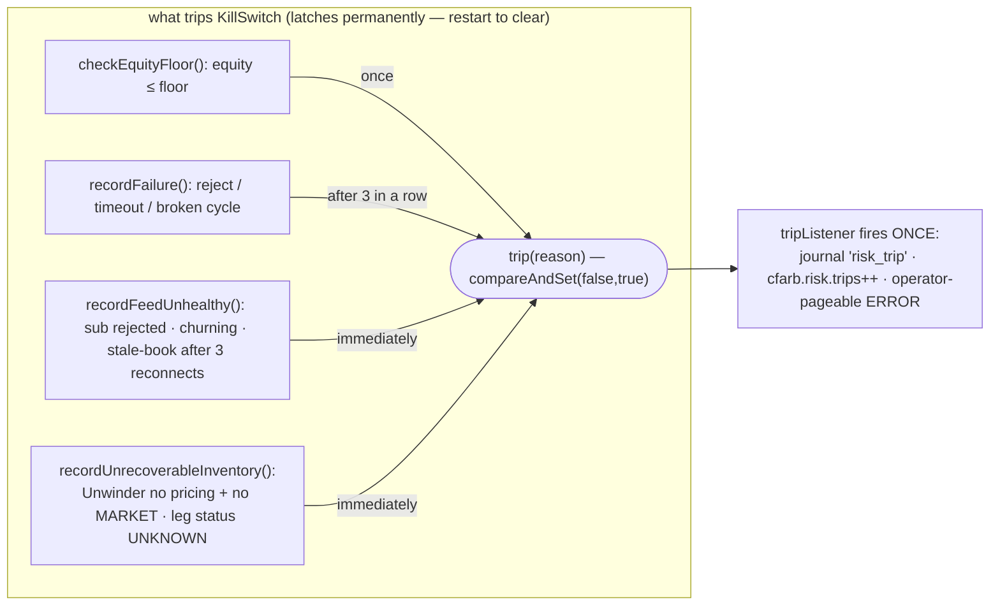

- **`Portfolio`** — equity com compounding, stablecoin anchor, `AtomicLong` fixed de 1e8,
  single-writer (executor thread). `applyRealizedPnl` (todas as 3 legs filled, pode ser negativo) e
  `applyBrokenCyclePnl` (broken cycle — *nem sempre* não positivo) fazem `addAndGet` + incrementam
  um counter. `pnlPctOfSeed()`, `realizedTradeCount()`, `brokenCycleCount()` lidos pela API.
- **`KillSwitch`** — `tripped()` trava permanentemente, sem auto-reset (S7). Uma exception do
  listener é capturada e logada, nunca mascarando o trip.
  **Mudança do third pass:** um status de leg `UNKNOWN` agora é uma das fontes de trip *imediato*
  (via `recordUnrecoverableInventory`), junto do resultado unrecoverable do `Unwinder`.

---

## Estágio 10 — O journal: `journal.EventJournal` + `journal.JournalEvents` (+ `util.EpochMicros`)

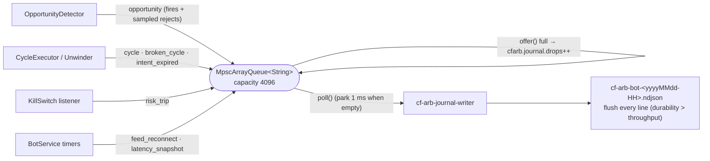

- **`EventJournal`** — `MpscArrayQueue<String>(4096)` **limitado** (produtores: threads do detector
  + do executor; consumidor: um daemon `cf-arb-journal-writer`). `write(...)` é `queue.offer(...)`;
  um ring cheio → `metrics.recordJournalDrop()` (nunca aplica backpressure no hot path). Arquivos
  rotacionados por hora sob `cf-bot.journal.dir`, com flush a cada linha. Sync com S3 ainda não
  implementado. A retenção na máquina do deploy é um systemd timer baseado em `find` (não
  logrotate — cada arquivo horário é um logfile distinto cuja cadeia nunca avança).
- **`JournalEvents`** — montagem manual de string (sem Jackson neste caminho). Tipos de evento:
  `opportunity`, `cycle`, `broken_cycle`, **`intent_expired`** (novo — ver Estágio 6), `risk_trip`,
  `feed_reconnect` (o reason agora inclui `post-reconnect-still-dark`), `latency_snapshot`. Todo
  campo string passa por `esc()`; doubles não finitos viram JSON `null`. `EpochMicros.now()`
  carimba `ts_us` — nunca usado para gating no hot path.

---

## Estágio 11 — Observabilidade: `metrics.BotMetrics`, `api.BotApiResource`, `api.ReadinessCheck`

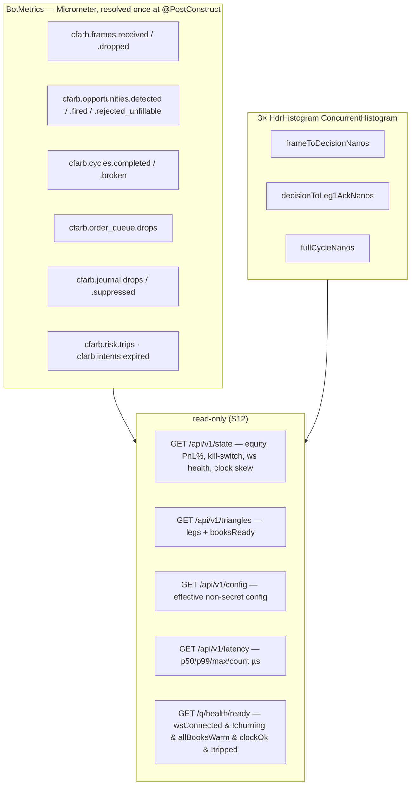

**Adição do third pass:** `cfarb.journal.suppressed` — um reject que o detector deliberadamente
*não* enviou ao journal porque aquele triângulo já enviou um dentro de `reject-sample-ms`.
Amostragem, não perda; contado para que "quantos candidatos vimos de fato" nunca precise ser
inferido da contagem de linhas do NDJSON.

> ⚠ **Nota.** Endpoints do §8 do plano não implementados: `/api/v1/opportunities`,
> `/api/v1/cycles`, idade de book por-símbolo, uptime, last-fire / PnL acumulado por-triângulo
> (CLAUDE.md).

---

## Side threads

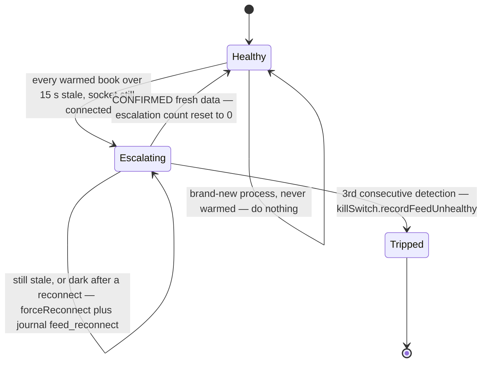

**Timers periódicos Vert.x do `BotService`** (event-loop thread; read-only em relação ao estado de
trading):

| timer | período | faz |
|---|---|---|
| warm-up + clock-skew | 60 s (e uma vez no startup) | `restClient.warmUp()` + `serverTime()`; skew `= (localStart + rtt/2) - serverMs`, RTT > 2 s descartado; `riskGates.updateClockSkew(...)` |
| feed watchdog | 5 s | máquina de estados `decideWatchdogAction(...)` (abaixo); também trava imediatamente em `wsClient.isChurning()` |
| latency snapshots | 60 s | uma linha de journal `latency_snapshot` por histograma (pulada se vazio) |

**Mudança do third pass (M3) — `decideWatchdogAction` agora é um método estático puro e
unit-testado** (`BotServiceWatchdogTest`). A forma inline antiga zerava o counter de escalação
sempre que `!feedDead` — o que *também* é verdade logo após `forceReconnect()` (seu `closeHandler`
chama `books.resetAll()`, zerando todo `updateCount`, então `anyWarmed` é false no tick seguinte).
Um feed que ficasse dark após reconectar poderia portanto *nunca* atingir o threshold de trip.
Agora **só dados frescos CONFIRMADOS** (`anyWarmed && !feedDead`) limpam uma escalação em
andamento; `!anyWarmed` durante uma escalação já em curso continua contando
(`post-reconnect-still-dark`).

**`exec.UserDataStream`** (só live) — confirmação suplementar de fills, best-effort, via o stream
privado `listenKey` da MEXC (`POST` para obter, `PUT` a cada 25 min como **query param**, conectar
em `wss://…/ws?listenKey=<key>`). **Só loga frames** — não está ligado ao caminho de fill do
`CycleExecutor`, **não verificado contra o endpoint live** (CLAUDE.md #9 / TODO da Fase 1). O WS
client é criado uma vez e reutilizado entre reconnects. A correção nunca depende disso — o
`OrderReconciler` é a autoridade.

---

## Modelo de threading (como o código implementa)

| Thread | É dona de | Touchpoints verificados |
|---|---|---|
| Netty event loop (`MexcWsClient`) | decode → book update → `OpportunityDetector` (incl. `RiskGates.canFire`/`claim`, `EdgeCalculator`, `Sizer`, `journalReject` amostrado) | nunca aloca no steady path exceto no ramo de fire; única escritora de todo `L2Book` e do estado de cooldown/ring |
| `cf-arb-executor` (`CycleExecutor`) | drenar a SPSC → 3 legs sequenciais (`OrderReconciler` → `MexcRestClient`/`MexcSigner`) → `Unwinder` → `Portfolio`/`KillSwitch` | lê `L2Book.isTrusted()` / `ageNanos` / `topBidFixed` / `topAskFixed` (exceção declarada) só para o `Unwinder`; única chamadora de `riskGates.onCycleFinished()` por ciclo |
| `cf-arb-journal-writer` (`EventJournal`) | drenar a MPSC → append NDJSON + flush | dropa + conta num ring cheio; nunca bloqueia um produtor |
| Quarkus HTTP worker (`BotApiResource`, `ReadinessCheck`) | JSON read-only | lê booleans/longs dos accessors do `BotService`; `MexcWsClient.isChurning()` é `synchronized` |
| Timers periódicos Vert.x (`BotService`) | warm-up, clock-skew, feed watchdog, latency snapshots | só `killSwitch.record*`, `journal.write`, `riskGates.updateClockSkew` — nunca uma decisão de trading direta |

---

# Cenários passo a passo

Três traces ponta a ponta. Cada um tem um walk em texto e um sequence diagram. Assuma o bot
aquecido, `dry-run=false` (live) salvo indicação, `min-net-bps=5.0`, `slippage-buffer-bps=1.0`
(então o threshold de fire é **6.0 bps**), `seed=$100`, triângulo `usdt-btc-xrp-fwd` =
`BTCUSDT:ASK → XRPBTC:ASK → XRPUSDT:BID`.

## Cenário 1 — um tick que não é uma oportunidade

Chega um depth frame de `XRPBTC`. Seu book atualiza. O detector avalia todo triângulo que toca
`XRPBTC` (`usdt-btc-xrp-fwd`, `usdt-btc-xrp-rev`). Para o triângulo forward:

1. `onWsFrame` carimba `nowNanos`, `classifyFrame` → `MARKET_DATA`, `MexcDepthDecoder.decode`
   preenche o `DepthFrame`, `BookRegistry.applyFrame` acha o índice do símbolo e chama
   `L2Book.apply` (sem version gap, níveis mesclados, `topBid`/`topAsk` republicados, ainda
   `trusted`).
2. `detector.onBookUpdated` → `trianglesForSymbol` → `evaluate(usdt-btc-xrp-fwd)`.
3. **`allLegsFresh`** — os três (`BTCUSDT`, `XRPBTC`, `XRPUSDT`) estão trusted, não vazios, não
   crossed, idade ≤ 250 ms → passa.
4. `candidateNotional = min($100 equity, $200 cap) = $100`.
5. **`riskGates.canFire`** — kill switch livre, amostra de clock-skew fresca e dentro de 2.5 s, 0
   ciclos abertos, notional na faixa, triângulo fora do cooldown, ring não cheio → `true`.
6. **`EdgeCalculator.evaluate`** faz VWAP-walk nos três ladders reais, quantiza cada leg, aplica o
   taker fee de cada símbolo → `fillable = true`, `netBps = 3.1`.
7. `metrics.recordOpportunityDetected()`. **`3.1 ≤ 6.0`** → abaixo do threshold.
8. **`journalReject("below-threshold")`** — escreve uma linha `opportunity` com `fired=false`
   *apenas se* esse triângulo não enviou um reject ao journal nos últimos `reject-sample-ms`
   (1000 ms); senão `cfarb.journal.suppressed++` e nada é escrito.
9. `evaluate` retorna. **Sem `claim`, sem `OrderIntent`, sem queue, o executor nunca acorda.**

Outros desfechos silenciosos que nem chegam ao passo 8: uma leg stale/crossed/untrusted (o passo 3
retorna), ou `canFire` false — cooldown, ciclo aberto, kill switch (o passo 5 retorna). Esses não
produzem linha de journal e nenhuma métrica além dos counters já incrementados.

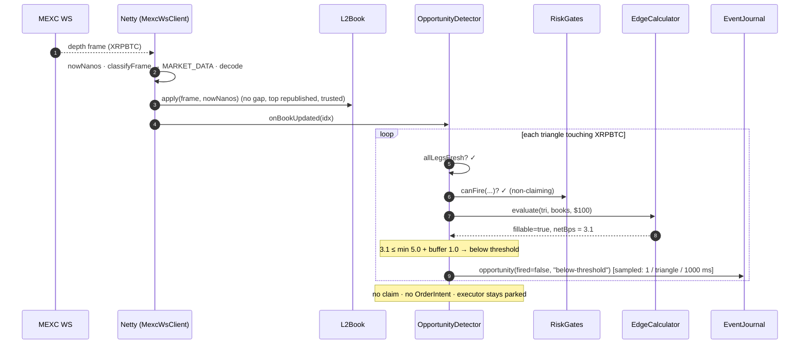

## Cenário 2 — uma oportunidade que dá certo (lucro)

Mesmo formato de tick, mas o walk volta com `netBps = 9.0` (> 6.0). Live mode.

1. Passos 1–6 como acima, exceto que `EdgeCalculator` retorna `netBps = 9.0` e, por leg,
   `legWorstPriceFixed[]` / `legBaseQtyFixed[]`.
2. **`riskGates.claim(triangleIndex, nowNanos)`** — carimba o slot de cooldown, empurra o ring de
   cycles/minute, `openCycles → 1`.
3. `OrderIntent` (+ duas cópias `long[3]`) alocado; `orderQueue.offer(intent)` tem sucesso;
   `recordOpportunityFired()`; `journal.write(opportunity(fired=true))` (não amostrado).
4. **`cf-arb-executor`** faz poll do intent. `killSwitch.tripped()` → false.
   `age = now - detectedAtNanos = 40 ms ≤ 150 ms` → segue. `dryRun=false` → `executeLive`.
5. **Leg 0** (`BTCUSDT:ASK`, comprar BTC com USDT): `inputAmountFixed = candidateNotional`
   ($100). `requestedBaseQtyFixed = legBaseQtyFixed[0]` literal.
   `reconciler.submitAndReconcile` → `POST /api/v3/order` retorna `{orderId}` → `GET /api/v3/order`
   retorna `status=FILLED, executedQty` → status terminal, sem cancel → `GET /api/v3/myTrades` →
   commission em BTC. `classifyFill` → `FILLED`. `carryAmount = netProceeds(leg0)` = BTC recebido −
   commission.
6. **Leg 1** (`XRPBTC:ASK`, comprar XRP com BTC): `inputAmountFixed = carryAmount`.
   `quantizeLeg(ASK, XRPBTC, carryBTC, price)` → base qty + quote; ambos passam `minQty` /
   `minNotional`. Submete → reconcilia → `FILLED`. `carryAmount = netProceeds(leg1)` = XRP recebido
   − commission.
7. **Leg 2** (`XRPUSDT:BID`, vender XRP por USDT): igual, `FILLED`. `finalAnchor = netProceeds(leg2)`
   = USDT recebido − commission.
8. `anchorSpent = leg0.executedQuoteFixed` (USDT de fato gasto na leg 0).
   `pnl = finalAnchor - anchorSpent` (positivo). `portfolio.applyRealizedPnl(pnl)` →
   `killSwitch.recordSuccess()` (zera o counter de falhas consecutivas) →
   `killSwitch.checkEquityFloor()` → `metrics.recordCycleCompleted()` →
   `journal.write(cycle(...))` com PnL realizado, equity depois, duração.
9. O `finally` de `execute` → `riskGates.onCycleFinished()` (`openCycles → 0`) +
   `recordFullCycleNanos`.

*Variante dry-run:* no passo 4 → `executePaper` em vez disso — `signAndDiscardForLatencyMeasurement`
monta e assina 3 payloads de ordem pelo caminho de código real e os descarta (`.send()` nunca é
chamado), então credita `pnl = candidateNotional × (detectedNetBps / 10_000)` diretamente e envia
um `cycle` ao journal. Sem rede, sem `Unwinder`, sem `CycleState`.

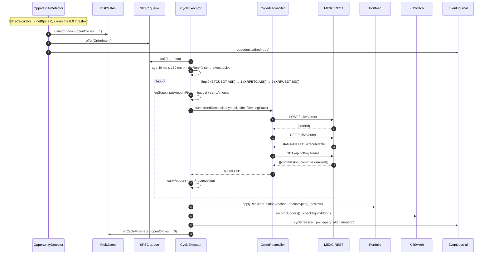

## Cenário 3 — uma oportunidade que falha (broken cycle + unwind)

O detector dá fire exatamente como no Cenário 2. Live mode. A leg 0 preenche. **A leg 1 volta
`PARTIAL`** — o book se moveu entre a detecção e a execução, e a ordem IOC em
`legWorstPriceFixed[1]` preencheu só ~60% do XRP pretendido, consumindo só ~60% do BTC que
recebeu.

1. Leg 0 (`BTCUSDT:ASK`) → `FILLED`. `carryAmount = netProceeds(leg0)` (BTC em mãos).
2. Leg 1 (`XRPBTC:ASK`): `legState.inputAmountFixed = carryAmount` (todo o BTC).
   `submitAndReconcile` → `POST` ok → `GET /api/v3/order` → `status=PARTIALLY_FILLED` (não
   terminal, fora do allowlist) → **`DELETE /api/v3/order`** (cancel) → **`GET /api/v3/order`** de
   novo → `status=CANCELED, executedQty` ≈ 60% → terminal. `classifyFill` → `0 < executed <
   requested` → **`PARTIAL`**. Commission buscada.
3. Switch de `executeLive` → `PARTIAL` → **`handleBrokenCycle(triangle, state, failedLeg=1,
   "partial-fill")`**. `metrics.recordCycleBroken()`.
4. **`Unwinder.unwind(triangle, state, 1)`**:
   - Held leg = **1** (`PARTIAL`). `working = netProceeds(leg1)` = XRP adquirido (≈ 60% do alvo).
   - `i = 1`: `reverseSide = BID` (vender XRP por BTC em `XRPBTC`).
     `priceReversal` — o book de `XRPBTC` está trusted e fresco (idade < 5 s) → cruza o `topBid`
     para baixo em 40 bps, faz clamp dentro de `PERCENT_PRICE_BY_SIDE` (floor arredondado para cima
     para um tick). `quantizeLeg` → base + quote passam os mínimos. `submitAndReconcile` →
     `FILLED`. `lastReversalProceeds` = BTC recuperado → `working`.
   - `i ≥ 1` → **`working += residualHeldBy(ASK, leg1)`** = `inputAmountFixed - cummulativeQuoteQty`
     = os ~40% de BTC que a leg 1 nunca gastou. **Agora `working` = BTC recuperado + BTC não
     gasto.**
   - `i = 0`: `reverseSide = BID` (vender BTC por USDT em `BTCUSDT`). Preço a partir do top atual
     de `BTCUSDT`, submete → `FILLED`. `working` = USDT = anchor. A leg 0 *não* é acrescida de um
     residual (seu from-asset é o anchor; `anchorSpent` já mede o gasto real da leg 0).
   - Retorna `Result(recoveredAnchorFixed = working, unrecoverable = false, "reversed legs 1..0")`.
5. De volta em `handleBrokenCycle`: `anchorSpent = leg0.executedQuoteFixed` (USDT gasto na leg 0).
   `loss = recoveredAnchorFixed - anchorSpent` — **negativo** (duas reversals, cada uma pagou o
   spread + taker fee). `portfolio.applyBrokenCyclePnl(loss)` → nova equity.
6. `r.unrecoverable()` é false → **`killSwitch.recordFailure("partial-fill (leg 1,
   usdt-btc-xrp-fwd)")`** — counter de falhas consecutivas → 1 (trava aos 3).
   `killSwitch.checkEquityFloor()`. `journal.write(broken_cycle(failed_leg=1, "partial-fill",
   loss_usd, equity_after))`.
7. O `finally` de `execute` → `riskGates.onCycleFinished()` (`openCycles → 0`).

**Outros formatos de falha:**
- **`ZERO_FILL` na leg 1** — idêntico, exceto que held leg = **0**, então o `Unwinder` reverte só
  a leg 0 (vender o BTC de volta por USDT). `residualHeldBy` não se aplica à leg 0.
- **`UNKNOWN` em qualquer leg** (a reconciliação não conseguiu estabelecer um estado terminal, ou
  um cancel não limpou a ordem) — **nenhum unwind roda.** `killSwitch.recordUnrecoverableInventory(...)`
  trava **imediatamente**; `journal.write(broken_cycle(...,
  "reconciliation-unknown-operator-review-required", loss=0))`. O inventário é deixado exatamente
  como está para um humano.
- **Unrecoverable** (o `Unwinder` precisa reverter uma leg em `ETHUSDC`/`SOLUSDC`/`XRPUSDC` mas o
  book está stale/untrusted *e* o símbolo não anuncia `MARKET`) — `Result(unrecoverable=true)` →
  `recordUnrecoverableInventory` → trip imediato, posição registrada no journal como stranded.

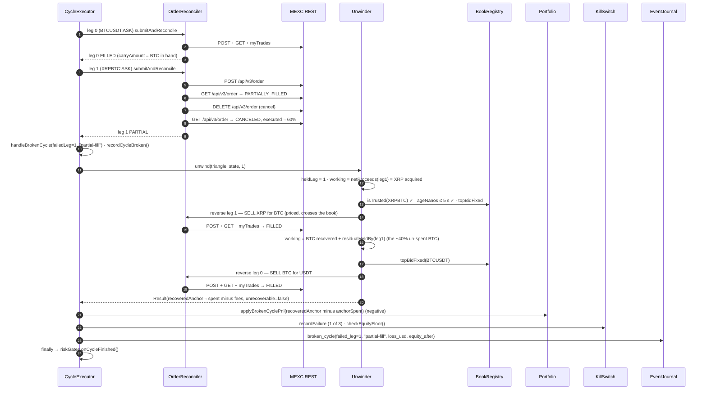

---

## Discrepâncias e ressalvas encontradas ao escrever isto

Nenhuma é bug; são lugares onde um javadoc ou o README está mais frouxo que o código, ou uma
superfície genuinamente não verificada.

1. **Escopo do histograma `frameToDecision`.** Medido sobre decode + `BookRegistry.applyFrame`
   apenas — para *antes* de `OpportunityDetector.onBookUpdated`, começa *depois* da cópia
   `getBytes()` e de `classifyFrame`. Não é "chegada no wire → decisão de fire". (Estágio 1)
2. **Contagem de version-gap.** `L2Book.apply` retorna um boolean de gap "para o caller poder
   contar"; `BookRegistry.applyFrame` o descarta e nada conta os gaps. O `reset()` ainda dispara.
   (Estágio 3)
3. **"Uma alocação" num fire.** `OpportunityDetector` aloca o `OrderIntent` mais duas cópias
   `long[3]` no ramo de fire, não literalmente um objeto. Ainda assim, só no ramo raro. (Estágio 4)
4. **O histograma `decisionToLeg1Ack` é misturado.** Registrado uma vez por leg (as 3), cada um
   cobrindo o round trip inteiro `place → query → cancel? → trades`. Nomeado como se fosse só a
   leg 1; a separação por-estágio é um item aberto de Tier-3. (Estágio 6, CLAUDE.md)
5. **O dry-run assina `type=LIMIT`.** O caminho de latência sign-and-discard fixa `LIMIT`; uma
   ordem live usa `IOC`. Os bytes assinados diferem um pouco; nada é enviado. (Estágio 6)
6. **`IOC` e `quoteOrderQty` são ambos não verificados contra a MEXC.** `exchangeInfo` nunca lista
   `IOC`/`FOK` para nenhum símbolo, e nenhuma request com credenciais exercitou `quoteOrderQty`
   (usado no fallback MARKET-BUY do `Unwinder`). Ambos fail safe (um 4xx → `REJECTED_PRESUBMIT` /
   "stranded, operator review"); o probe live de 1 USDT é o gate real antes de `dry-run=false`.
   (Estágios 6, 8, CLAUDE.md)
7. **O journaling de rejects é amostrado.** Várias oportunidades *distintas* no mesmo triângulo
   dentro de `reject-sample-ms` (1000 ms) colapsam numa linha `opportunity(fired=false)` — só a
   primeira carrega o detalhe; o resto vira `cfarb.journal.suppressed++`. Uma sessão reconstruída
   puramente do NDJSON subestima os near-misses; o counter é o total honesto. (Estágio 4)
8. **`UserDataStream` está presente mas inerte e não verificado** — não ligado ao caminho de fill,
   o fluxo de listen key nunca foi testado ao vivo. (Side threads)
9. **Sem reconciliação de saldo live no boot** — `Portfolio` é um único número em memória semeado
   da config; um restart não busca nem reconcilia a conta live, e inventário non-anchor deixado por
   um desfecho `UNKNOWN`/stranded anterior é invisível para ele. Necessário antes de qualquer
   execução live não supervisionada. (Gaps conhecidos do CLAUDE.md)
10. **`terraform/`, o probe de RTT de Tóquio e o sync do journal com S3 nunca rodaram** — não havia
    credenciais AWS no ambiente que os escreveu. (CLAUDE.md / README.md)
11. **O preço de referência de `PERCENT_PRICE_BY_SIDE` não é verificado.** `Unwinder.clampToPriceBand`
    assume que a banda é relativa ao top-of-book atual; se a MEXC usa isso ou uma média móvel
    continua sendo uma questão aberta de probe live. (Estágio 8, CLAUDE.md)
12. **`FixedPoint.SCALE` faz clamp na precisão de preço de XRPBTC** (9 decimais no venue → 8). Agora
    logado como um `WARN` alto no startup (third pass) em vez de clamp silencioso, mas a potencial
    discrepância de edge-calc nesse símbolo só se resolve com o probe com credenciais. (Estágio 0)
13. **Sem unit test dedicado de `OpportunityDetector`.** A ordem dos seus gates é exercitada
    transitivamente (`RiskGatesTest`, `EdgeCalculatorTest`, `SizerTest`, `CycleExecutorTest` dirige
    a fronteira SPSC→executor, `BotServiceWatchdogTest` cobre a máquina de estados do watchdog,
    `OrderReconcilerTest` as correções M4/M5/M6) — mas nada verifica a sequência própria de checks
    do detector diretamente.
