# cf-arb-bot — architecture tour

A guided tour of every module the bot touches, **in the order a single market-data frame flows
through them**, from the WebSocket byte on the wire to a journal line on disk.

- **[`README.md`](README.md)** — the "why", the setup, and the going-live checklist. Start there;
  this document is the deep dive it points to.
- **[`CLAUDE.md`](CLAUDE.md)** — the safety non-negotiables and the documented gaps.
- **[`Architecture-tour-pt.md`](Architecture-tour-pt.md)** — este mesmo documento em português do Brasil.

This file is the "what happens, in what order, in which class". Where the running code does
something subtly different from what a javadoc or the README says, there is a **⚠ Note**; those are
collected at the bottom under
[Discrepancies & caveats](#discrepancies--caveats-found-while-writing-this).

Checked against `main` at commit `a6deefb` (the merge of the third-pass review — PR #1). The
diagrams are Mermaid — they render on GitHub and in most Markdown viewers. Every section has one.

## The whole pipeline at a glance

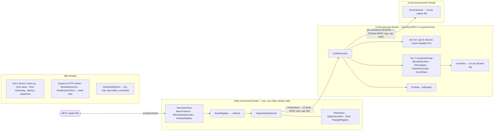

---

## Stage 0 — Startup & wiring: `BotService`

`io.cfarb.BotService` is `@ApplicationScoped`; everything happens in `onStart(@Observes
StartupEvent)`. It is the only place the object graph is assembled (only `BotConfig`, `Vertx`,
`BotMetrics` are CDI-injected). Construction order matters — later objects depend on earlier ones.

```mermaid
flowchart TD
    A["logStartupSafetyBanner()<br/>DRY-RUN banner / loud LIVE warning (S4)"] --> B
    B["loadFilters() → SymbolFilterLoader<br/>cf-bot.filters-path or classpath mexc_filters.json"] --> C
    C["BookRegistry — one L2Book per symbol<br/>WARMUP_UPDATES=50, WARMUP_SECONDS=30"] --> D
    D["TriangleRegistry — Triangle[] + int[][] trianglesBySymbol<br/>validates each triangle chains &amp; closes at the anchor"] --> E
    E{"dryRun?"}
    E -->|no| E1["validateOrderType(filters)<br/>every leg must advertise LIMIT; IOC/FOK → loud WARN"]
    E -->|yes| F
    E1 --> F
    F["seed-usd &gt; 0 &amp; equity-floor-usd &gt; 0, else throw"] --> G
    G["Portfolio(seed) → KillSwitch(floor, maxConsecutiveFailures) → RiskGates<br/>RiskGates clamps max-notional-usd to $1000 (S6)"] --> H
    H["EventJournal.start() — spawns cf-arb-journal-writer"] --> I
    I["wireKillSwitchTripListener() + killSwitch.checkEquityFloor() (before the feed connects)"] --> K
    K["SpscArrayQueue&lt;OrderIntent&gt;(256)"] --> L
    L["OpportunityDetector(... rejectSampleMs)"] --> M
    M["MexcRestClient — BOTH modes<br/>dry-run: dummy signer, never sends. live: MEXC_API_KEY/SECRET from env (S1)"] --> Nn
    Nn{"dryRun?"}
    Nn -->|no| N1["Unwinder + UserDataStream.start()"]
    Nn -->|yes| O
    N1 --> O
    O["CycleExecutor.start() — spawns cf-arb-executor"] --> Pp
    Pp["MexcWsClient.start() with MexcProtocol.subscribeMessages(...)"] --> Q
    Q["3 Vert.x periodic timers: warm-up+clock-skew, feed watchdog, latency snapshots"]
```

`onStop(@Observes ShutdownEvent)` stops, in order: ws client, executor, user-data stream, journal.

**Third-pass change:** the detector constructor now also takes `config.journal().rejectSampleMs()`
(default 1000 ms) — see Stage 4.

---

## Stage 1 — The market-data socket: `feed.MexcWsClient` (+ `feed.MexcProtocol`, `util.ByteScan`)

**One** WebSocket connection carries all 9 symbols (MEXC caps 30 streams/connection). Scaffolding
(WS options, capped-exponential backoff, fragmented-frame reassembly, reconnect-churn tracking) is
ported from `recorder-service`; the payload handling is rewritten to decode-in-place.

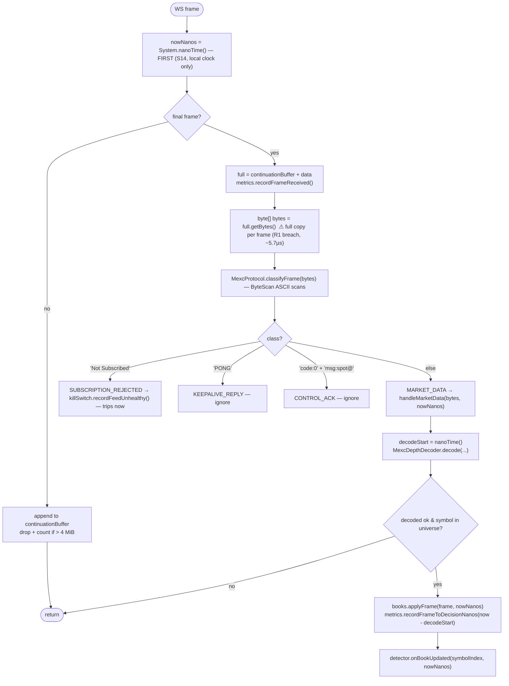

- **`connect()`** on success registers `frameHandler`, an exception handler, and a `closeHandler`
  that flips `connected=false`, cancels keepalive, calls **`books.resetAll()`**, and schedules a
  reconnect. It also calls `books.resetAll()` *again* right before re-subscribing, then sends the
  `SUBSCRIPTION` messages and starts a 20 s `{"method":"PING"}` keepalive timer.
- **`MexcProtocol.subscribeMessages`** turns `aggre.depth@10ms` into
  `spot@public.aggre.depth.v3.api.pb@10ms@%s`, batched ≤30 symbols per message. Its javadoc records
  the rule: `increase.*` / bare `bookTicker` are silently blocked by MEXC — never add a channel
  without a live probe.
- **Health helpers**: `forceReconnect()` (closes the socket to run the normal recovery path),
  `isChurning()` (≥5 connects in a 5-min sliding window, pruned on *read* too), `isConnected()`.
  `recentConnectMillis` is `synchronized` (read from the HTTP worker).

> ⚠ **Note.** `recordFrameToDecisionNanos` spans **decode + `BookRegistry.applyFrame` only** — it
> stops *before* `detector.onBookUpdated`, and starts *after* the `getBytes()` copy and
> `classifyFrame`. `/api/v1/latency`'s `frameToDecisionUs` is "decode+apply", not "wire to fire".

---

## Stage 2 — Decode: `feed.MexcDepthDecoder` + `feed.ProtobufWalker` (+ `util.FixedPoint`)

No `.proto`, no `protoc`, no `protobuf-java` (R11); strictly iterative (S8); zero allocation on the
steady path (R1).

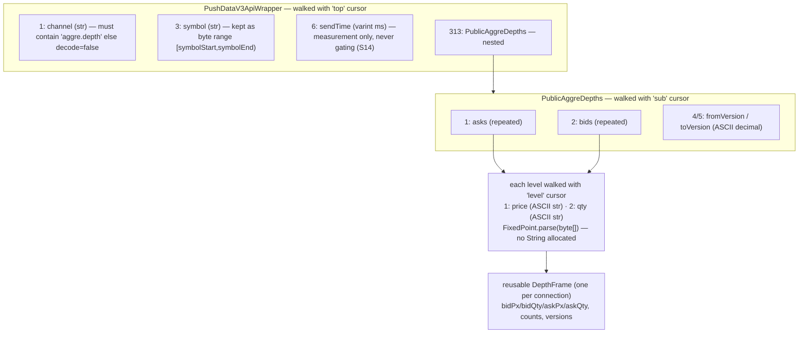

- **`ProtobufWalker`** — a generic tag/length walker over `byte[]`. One reusable `Cursor` per
  nesting level (`topCursor`, `subCursor`, `levelCursor`, allocated once in `MexcWsClient`).
  Length-delimited fields expose `[lenStart, lenEnd)` **as a range into the original buffer**. Any
  truncation / bad varint / unsupported wire type sets `cursor.malformed = true` and returns
  `false` — fail-closed sentinel, no exception on the hot path (R14).
- Levels beyond `MAX_LEVELS = 50` are silently dropped (understating depth — the safe direction). A
  malformed individual level is dropped without poisoning the frame; a malformed *structure*
  returns `false`. `decode` → `false` means "not a depth frame", never an error.
- Verified against 8 real captured frames (`src/test/resources/fixtures/mexc_depth_*.pb.bin`,
  oracle from the Python decoder) in `MexcDepthDecoderTest`.

**`FixedPoint`** (1e8 fixed-point) also carries:

- **`mulDiv(a,b,c)`** — overflow test is `Math.multiplyHigh(a,b) != (low >> 63)`.
  **Third-pass change (NEW-6):** the overflow branch no longer allocates `BigInteger` — a single
  BTCUSDT-sized top-of-book level already overflows the plain-`long` fast path, so `Sizer.fillAsk`'s
  `levelNotional` hit it on essentially every major-pair ladder walk *on the Netty thread* (a real
  R1 breach). For non-negative operands (every real caller) it now uses an allocation-free unsigned
  128÷64 bit division (`divideUnsigned128by64`), cross-checked against `BigInteger` over 100k
  random triples in `FixedPointTest`. Negative operands still fall back to `BigInteger`.
- **`quantizeDown`** (lot-size floor), **`toPlainString`** (plain decimal, **truncates** — never
  rounds, never scientific notation, which MEXC's order endpoint rejects).

---

## Stage 3 — Book state: `book.BookRegistry` + `book.L2Book`

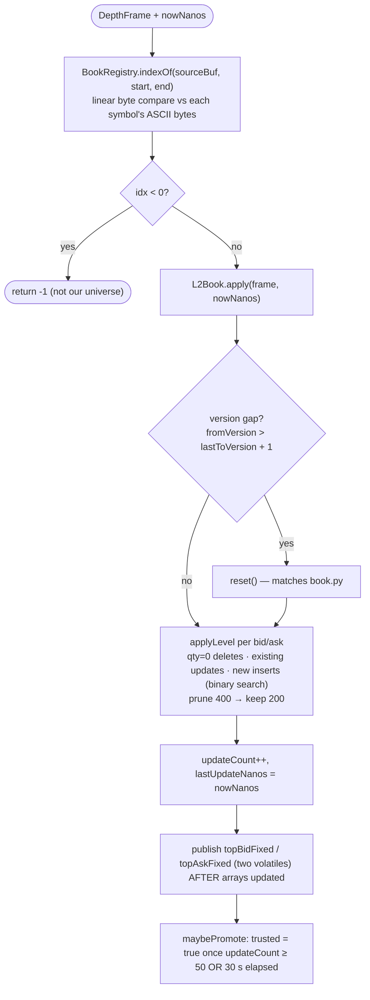

- **`BookRegistry`** — flat array indexed by position in `cf-bot.symbols` (R3). `resetAll()` on
  every disconnect + again before re-subscribe.
  **Third-pass additions:** `isTrusted(symbolIndex)` and `ageNanos(symbolIndex, now)` accessors,
  read cross-thread by `Unwinder` for its new reversal-pricing staleness gate (Stage 8).
- **`L2Book`** — one symbol, **not thread-safe by design** (Netty thread is the sole writer).
  Sorted primitive arrays (bids desc, asks asc, `CAPACITY = 512`). Health predicates:
  `isTrusted()`, `isCrossed()` (`bestBid >= bestAsk`), `isEmpty()` (either side empty),
  `ageNanos(nowNanos)`. `topBidFixed`/`topAskFixed` are published *after* the level arrays update,
  and read cross-thread by `Unwinder` only (CLAUDE.md non-negotiable #5's declared exception; a
  torn read there is harmless).

> ⚠ **Note.** `L2Book.apply` returns a version-gap boolean "so the caller can count it", but
> `BookRegistry.applyFrame` discards it and nothing counts gaps. The `reset()` on gap still fires.

---

## Stage 4 — Detection: `strategy.OpportunityDetector`

Runs **inline on the Netty thread** right after the book update. Zero allocation until an actual
fire.

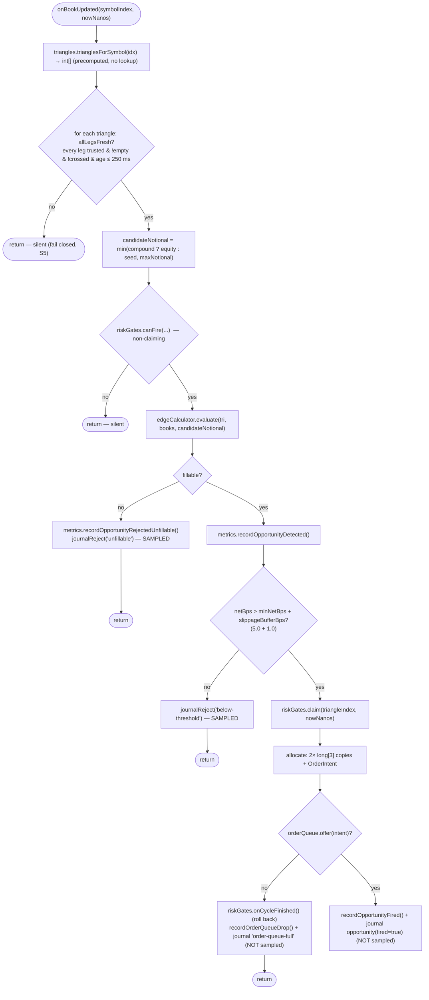

**Third-pass change — the reject stream is now sampled.** Every candidate that clears the cheap
gates lands on a reject path, and `canFire`'s per-triangle cooldown only advances on an actual
`claim`, so a triangle that never fires was writing a journal line (and a `String` allocation, on
the Netty thread — an R1 breach) on *every* book update it touched: ~900 lines/s, ~10 GB/day,
enough to fill the deployed 20 GB root volume in ~2 days of **dry-run**.

`journalReject(...)` now writes at most one line per triangle per `cf-bot.journal.reject-sample-ms`
(default 1000). Suppressed rejects are **counted** as `cfarb.journal.suppressed` (never silently
dropped). **Fires and `order-queue-full` are never sampled** — they are rare by construction and
are what an operator reconstructs a session from. Per-triangle `lastRejectJournalNanos[]` is
seeded to `Long.MIN_VALUE/2` so the *first* reject per triangle always journals.

> ⚠ **Note.** The class javadoc still says "one `OrderIntent` is allocated" on a fire; the code
> allocates three objects there (the intent + two `long[3]` copies). Still only the rare branch.

### Stage 4a — Gates: `risk.RiskGates`

Single-writer (Netty thread) for the cooldown array and cycles/minute ring; only `openCycles` and
the kill-switch fields cross threads.

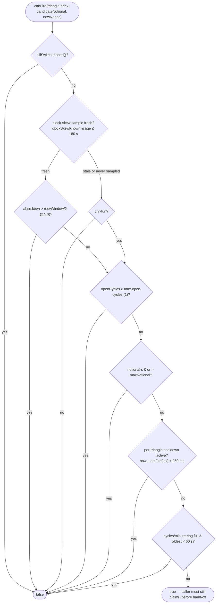

**Third-pass changes (M7):**
- Clock-skew **tolerance halved** — from the full `recvWindow` (exactly MEXC's `-1021`
  "timestamp outside recvWindow" boundary, zero margin) to `recvWindow / 2`. `recvWindow` itself is
  unchanged on the wire.
- Clock-skew samples now **expire.** `clockSkewKnown` used to latch `true` forever on the first
  successful sample. Now `updateClockSkew` also records `clockSkewSampleNanos`, and a sample older
  than `CLOCK_SKEW_SAMPLE_MAX_AGE_NANOS` (180 s = 3× the 60 s sampling cadence) is treated exactly
  like "never sampled" → fail closed in live mode. So a later loss of route to `/api/v3/time`
  degrades the gate back to safe instead of trusting an hours-old value.

`claim(...)` stamps the cooldown slot, pushes the ring timestamp, `openCycles.incrementAndGet()`.
`onCycleFinished()` → `openCycles.updateAndGet(n -> max(0, n-1))`. Non-positive `max-notional-usd`
/ `max-open-cycles` / `max-cycles-per-minute` **throw at construction**.

### Stage 4b — Edge math: `strategy.EdgeCalculator` + `strategy.Sizer`

CLAUDE.md #7: "the one piece that must be exactly right." Cross-checked against
`cf-arb-poc/cfarb/stage2_cycles.evaluate_cycle` in `EdgeCalculatorTest`; `Sizer` also has its own
`SizerTest` (added in the third pass).

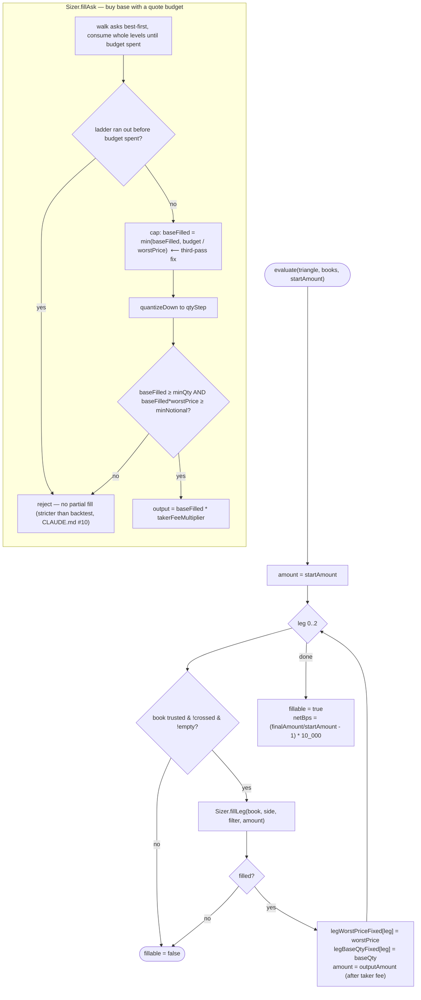

**Third-pass fix (`fillAsk`):** `baseFilled` is accumulated across ladder levels at each level's
*own* (better) price, so `baseFilled × worstPrice` could exceed the budget on a multi-level walk —
but the executor submits **one** IOC limit order for the full quantity *at* `worstPrice`, and
MEXC's balance check evaluates it at that limit price, not the VWAP. `fillAsk` now caps the
quantity so the worst-price notional never exceeds the budget: conservative (never orders more than
modelled), a no-op when a single level satisfies the size.

`fillBid` (sell base for quote): quantize the held base down first; reject if `< minQty`; walk bids
best-first; reject if displayed depth can't cover it or `quoteReceived < minNotional`.
`worstPriceFixed` (last ladder price touched) is the marketable IOC limit price the executor
requests — so a book that moved against us produces a partial/no fill (→ `Unwinder`), never a
*worse-than-computed* fill.

---

## Stage 5 — The hand-off: `model.OrderIntent` + the SPSC queue

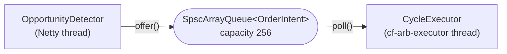

`SpscArrayQueue<OrderIntent>` (JCTools, cap 256) — one of the **three declared thread hand-offs**
(CLAUDE.md #5): detector→executor, the journal writer, and the live user-data stream. A fourth
needs a plan-doc change first.

**`OrderIntent`** (record): `detectedAtNanos`, `triangleIndex`, `candidateNotionalFixed`,
`detectedNetBps`, `legWorstPriceFixed[3]`, `legBaseQtyFixed[3]`. The executor submits leg 0's base
qty **verbatim**; legs 1–2 re-derive size from the previous leg's *actual* proceeds but must land
on the same quantization.

---

## Stage 6 — Execution: `exec.CycleExecutor`

Own daemon thread, `cf-arb-executor`. Blocking REST here is expected (R5/Q4).

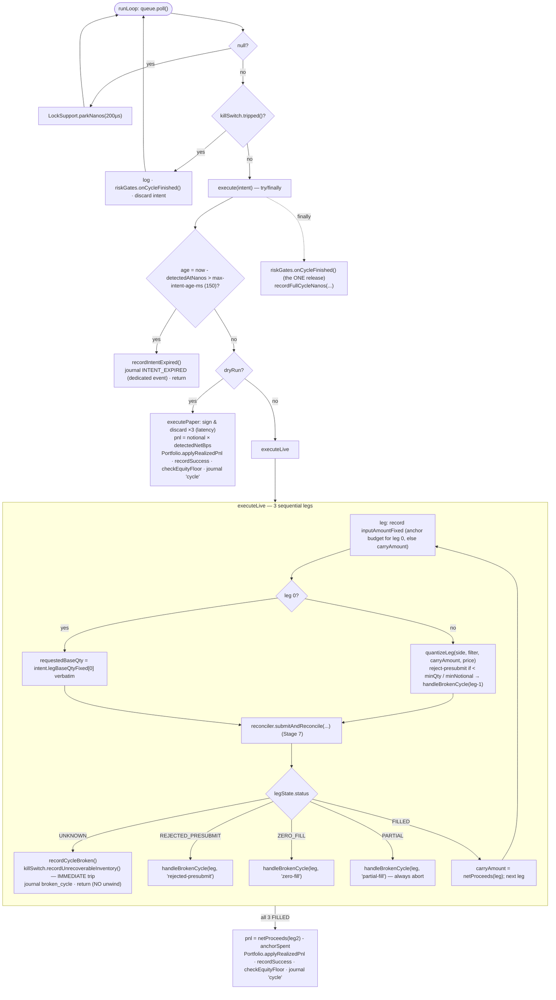

**Third-pass changes:**
1. **`CycleState.Leg.inputAmountFixed`** — each leg records *what it was handed* (anchor budget for
   leg 0, `carryAmount` for legs 1–2) **before submission**, so `Unwinder` can carry a PARTIAL
   fill's unspent remainder backwards instead of abandoning it (Stage 8).
2. **Stale intent** → `JournalEvents.intentExpired(...)` — a **dedicated** `intent_expired` event,
   not `brokenCycle` with a `failed_leg=-1` sentinel (which used to inflate the NDJSON
   broken-cycle line count while `cfarb.cycles.broken` was deliberately not incremented, leaving
   the journal and the Prometheus counter permanently disagreeing).
3. **`UNKNOWN` leg status** → `killSwitch.recordUnrecoverableInventory(...)` — **trips
   immediately**, matching `CycleState.LegStatus.UNKNOWN`'s own contract. It used to call
   `recordFailure` (3-strikes), so between the 1st and 3rd `UNKNOWN` the Portfolio went un-debited
   while the account might already hold non-anchor inventory from the first ambiguous leg.

**`handleBrokenCycle`**: `recordCycleBroken()` → `unwinder.unwind(triangle, state, failedLeg)` →
`loss = recoveredAnchorFixed - anchorSpent` (both anchor-denominated) → `applyBrokenCyclePnl(loss)`
if non-zero → `unrecoverable` ? `recordUnrecoverableInventory` (immediate) : `recordFailure`
(counts toward the 3-in-a-row trip) → `checkEquityFloor` → journal `broken_cycle`.

> ⚠ **Note.** `decisionToLeg1AckNanos` is recorded once **per leg** (all three), each spanning the
> whole `place → query → cancel? → trades` round trip, blended into one histogram. Known Tier-3
> gap (CLAUDE.md). The dry-run sign-and-discard also hard-codes `type=LIMIT` while a live order
> uses `IOC` — harmless (nothing is sent), but the signed bytes differ slightly.

---

## Stage 7 — Signed order I/O: `exec.MexcRestClient`, `exec.MexcSigner`, `exec.OrderReconciler`, `exec.CycleState`

MEXC has **no WebSocket order-entry API** — placement is REST only.

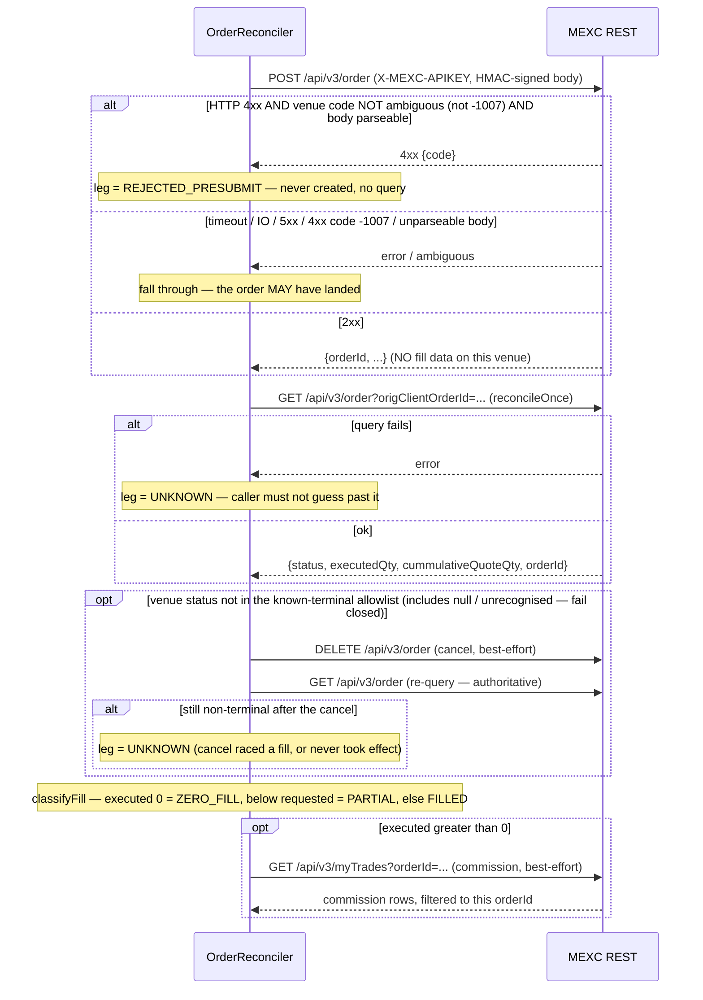

- **`MexcRestClient implements MexcOrderApi`** — one Vert.x `WebClient`, `keepAlive`, no pipelining,
  `maxPoolSize=4`. `warmUp()` → `GET /api/v3/ping` (keeps the pool socket alive across idle gaps);
  `serverTime()` → `GET /api/v3/time`. Non-2xx → `OrderRejectedException(statusCode, body)` (never
  logs the request/signature — S3). `sign(query)` — build + sign, return, **caller discards**
  (dry-run latency path).
- **`MexcSigner`** — HMAC-SHA256, lowercase hex, `keySpec` over the secret bytes; never a
  field-visible `String`, never logged. Verified in `MexcSignerTest` against a Python
  `hmac`/`hashlib` reference vector.
- **`OrderReconciler`** (package-private, shared by `CycleExecutor` and `Unwinder`).
  `netProceeds(side, filter, leg)` = proceeds in the leg's *to-asset*, minus the **confirmed**
  per-fill commission when it is in the received asset, else `raw × takerFeeMultiplierFixed`.

**Third-pass changes (M4/M5/M6):**
- **Not every HTTP 4xx is definitive.** Venue code `-1007` ("send status unknown; execution status
  unknown") is MEXC's *own* ambiguity signal and can arrive behind a 4xx from an edge proxy/WAF.
  `isAmbiguousRejection(body)` — only a response whose venue `code` is *outside* the ambiguous set
  skips reconciliation; a body that can't even be parsed **fails closed** into reconciliation.
- **`isNonTerminal` flipped to an explicit terminal allowlist** (`KNOWN_TERMINAL_STATUSES`).
  Anything not in it — known-resting `NEW`/`PARTIALLY_FILLED`, a *missing* `status`, or an
  unrecognized value — now triggers the cancel-and-verify path (was fail-*open* before).
- **A cancel that didn't clear the order is no longer trusted.** If the post-cancel re-query still
  reports non-terminal, the leg is `UNKNOWN`, not fed into `classifyFill`.

**`CycleState`** — executor-thread-owned, one per attempt. Per-leg `LegStatus` (`PENDING`,
`FILLED`, `PARTIAL`, `ZERO_FILL`, `REJECTED_PRESUBMIT`, `UNKNOWN`), `inputAmountFixed` (new),
requested/executed base+quote, `venueStatus`, `venueOrderId`, commission fields.

---

## Stage 8 — Recovery: `exec.Unwinder`

CLAUDE.md: "the single largest engineering risk in this build." Rewritten by three independent
review passes. `UnwinderTest` (now ~15 tests) + `CycleExecutorTest` exercise it.

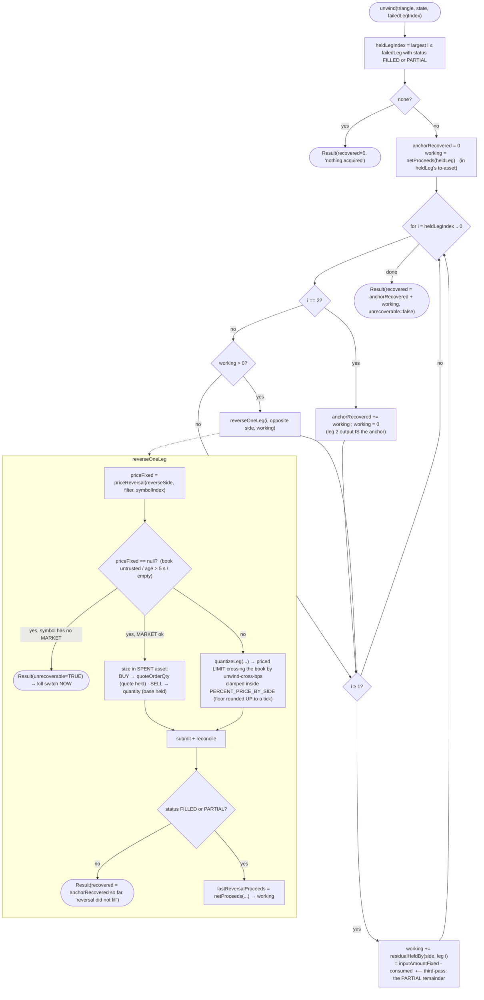

**How the walk works** (strictly-sequential execution → at most one leg's output is "in hand" —
*plus*, since the third pass, any PARTIAL fill's unspent input):

1. **Held leg** = largest `i ≤ failedLegIndex` with status `FILLED`/`PARTIAL`.
   - **None** → nothing acquired, nothing spent.
   - **Leg 2** → its proceeds *are* anchor-denominated (triangle-closure invariant) → banked into
     `anchorRecovered`; the walk still descends through legs 1 and 0 to pick up a **leg-2 PARTIAL's
     unsold leg-1 remainder**.
   - **Otherwise** → reverse leg `i` (opposite side, sized to what was acquired), then legs
     `i-1 … 0`, each step spending the previous reversal's actual proceeds. After leg 0's reversal
     the amount is anchor-denominated.
2. **`residualHeldBy(side, leg)` = `inputAmountFixed - consumed`** (an ASK leg spends quote /
   `cummulativeQuoteQty`, a BID leg spends base / `executedQty`) — carried backwards for legs
   `≥ 1`. **Leg 0 is excluded**: its from-asset is the anchor, its unconsumed remainder was never
   spent, and `CycleExecutor.anchorSpent` already measures the real leg-0 spend (adding it would
   double-count it as profit).
3. **Reversal pricing — `priceReversal`**: refuse to price (→ `null` → MARKET/stranded) if the
   book is untrusted, **older than `MAX_REVERSAL_PRICE_AGE_NANOS` (5 s)**, or has no top on the
   needed side. Otherwise cross the current top by `cf-bot.exec.unwind-cross-bps` (40) and
   `clampToPriceBand` inside `PERCENT_PRICE_BY_SIDE`. **The floor is rounded UP to a representable
   tick first**, so the later on-wire truncation (`toPlainString` never rounds) can't push the
   submitted price *below* the venue's real floor.
4. **MARKET fallback is sized in the asset being SPENT**: a SELL carries `quantity` (base held); a
   **BUY carries `quoteOrderQty`** (quote held) and **no `quantity`**. The first cut fed a
   placeholder price of `1.0` into `quantizeLeg` for both directions — a no-op for a SELL but a
   currency error for a BUY, turning ~100 USDC in hand into `MARKET BUY 100 BTC` on
   `usdt-btc-usdc-fwd`. `quoteOrderQty` is **unverified against MEXC** (same status as `IOC`); it
   fails safe — an unsupported parameter 4xx-rejects into `REJECTED_PRESUBMIT` ("stranded, operator
   review"), never a wrongly-sized order.
5. No pricing source **and** no `MARKET` (`ETHUSDC`/`SOLUSDC`/`XRPUSDC`) → `Result(unrecoverable =
   true)` → `KillSwitch.recordUnrecoverableInventory` (immediate). Held amount below the venue
   minimum, or a reversal that doesn't fill → `Result` with the anchor banked so far and a
   "STRANDED, operator review required" detail (`unrecoverable = false` — counts toward the
   ordinary trip).

---

## Stage 9 — Accounting & the kill switch: `state.Portfolio`, `risk.KillSwitch`

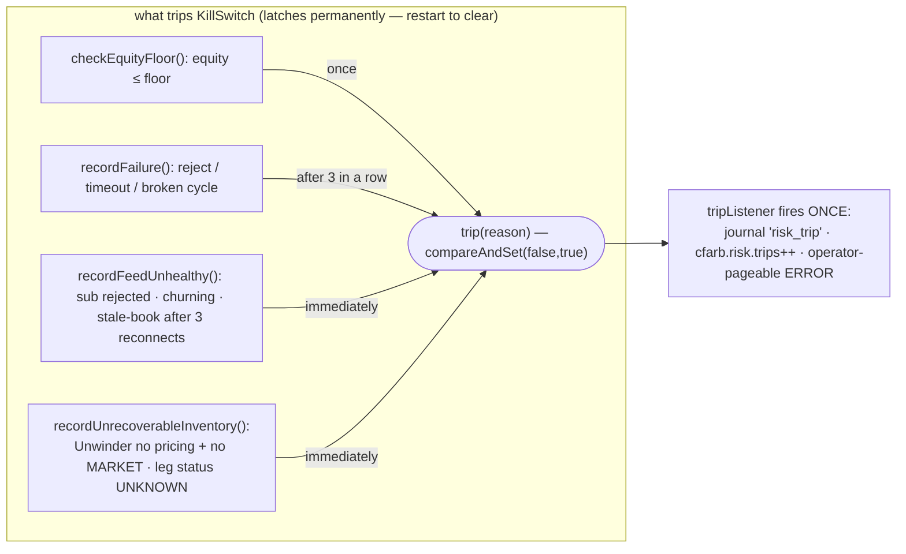

- **`Portfolio`** — compounding equity, anchor stablecoin, 1e8-fixed `AtomicLong`, single-writer
  (executor thread). `applyRealizedPnl` (all-3-legs-filled, may be negative) and
  `applyBrokenCyclePnl` (broken cycle — *not* always non-positive) each `addAndGet` + bump a
  counter. `pnlPctOfSeed()`, `realizedTradeCount()`, `brokenCycleCount()` read by the API.
- **`KillSwitch`** — `tripped()` latches permanently, no auto-reset (S7). A listener exception is
  caught and logged, never masking the trip.
  **Third-pass change:** an `UNKNOWN` leg status is now one of the *immediate* trip sources (via
  `recordUnrecoverableInventory`), alongside `Unwinder`'s unrecoverable result.

---

## Stage 10 — The journal: `journal.EventJournal` + `journal.JournalEvents` (+ `util.EpochMicros`)

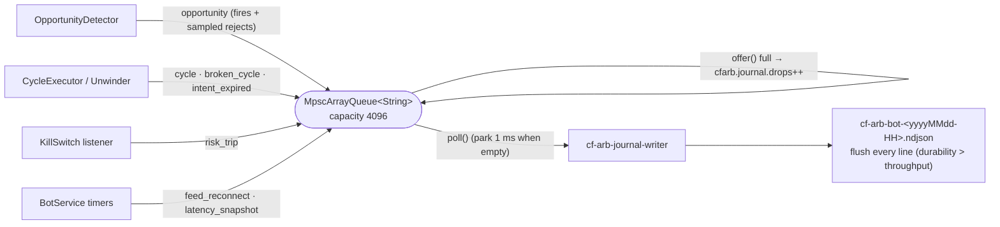

- **`EventJournal`** — **bounded** `MpscArrayQueue<String>(4096)` (producers: detector + executor
  threads; consumer: one `cf-arb-journal-writer` daemon). `write(...)` is `queue.offer(...)`; a
  full ring → `metrics.recordJournalDrop()` (never backpressures the hot path). Hourly-rotated
  files under `cf-bot.journal.dir`, flushed every line. S3 sync still not implemented. Retention on
  the deployed box is a `find`-based systemd timer (not logrotate — every hourly file is a distinct
  logfile whose chain never advances).
- **`JournalEvents`** — manual string building (no Jackson on this path). Event types:
  `opportunity`, `cycle`, `broken_cycle`, **`intent_expired`** (new — see Stage 6), `risk_trip`,
  `feed_reconnect` (reason now includes `post-reconnect-still-dark`), `latency_snapshot`. Every
  string field goes through `esc()`; non-finite doubles render as JSON `null`. `EpochMicros.now()`
  stamps `ts_us` — never used for hot-path gating.

---

## Stage 11 — Observability: `metrics.BotMetrics`, `api.BotApiResource`, `api.ReadinessCheck`

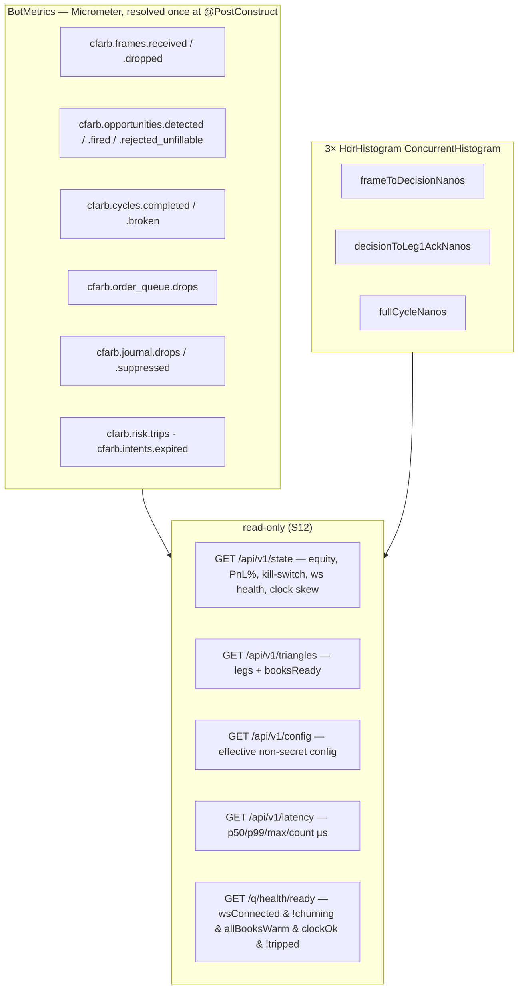

**Third-pass addition:** `cfarb.journal.suppressed` — a reject the detector deliberately did *not*
journal because that triangle already journaled one inside `reject-sample-ms`. Sampling, not loss;
counted so "how many candidates did we see" never has to be inferred from the NDJSON line count.

> ⚠ **Note.** Plan §8 endpoints not implemented: `/api/v1/opportunities`, `/api/v1/cycles`,
> per-symbol book age, uptime, per-triangle last-fire / cumulative PnL (CLAUDE.md).

---

## Side threads

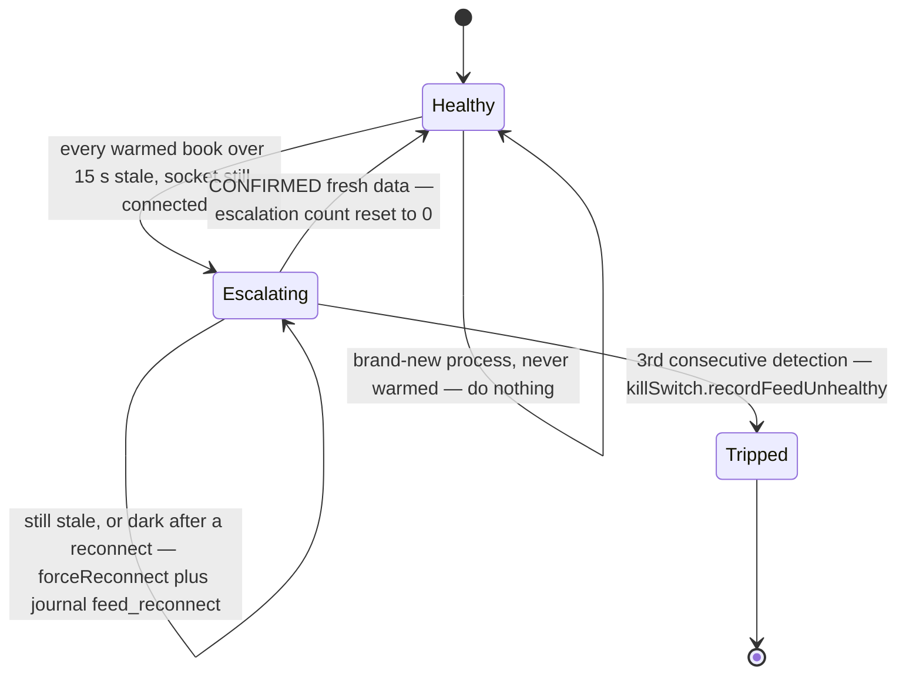

**`BotService` Vert.x periodic timers** (event-loop thread; read-only w.r.t. trading state):

| timer | period | does |
|---|---|---|
| warm-up + clock-skew | 60 s (and once at startup) | `restClient.warmUp()` + `serverTime()`; skew `= (localStart + rtt/2) - serverMs`, RTT > 2 s discarded; `riskGates.updateClockSkew(...)` |
| feed watchdog | 5 s | `decideWatchdogAction(...)` state machine (below); also trips immediately on `wsClient.isChurning()` |
| latency snapshots | 60 s | one `latency_snapshot` journal line per histogram (skipped if empty) |

**Third-pass change (M3) — `decideWatchdogAction` is now a pure, unit-tested static method**
(`BotServiceWatchdogTest`). The old inline form reset the escalation counter whenever `!feedDead`
— which is *also* true right after `forceReconnect()` (its `closeHandler` calls
`books.resetAll()`, zeroing every `updateCount`, so `anyWarmed` is false on the next tick). A feed
that stayed dark after reconnecting could therefore *never* reach the trip threshold. Now **only
CONFIRMED fresh data** (`anyWarmed && !feedDead`) clears an escalation in progress; `!anyWarmed`
while already mid-escalation keeps counting (`post-reconnect-still-dark`).

**`exec.UserDataStream`** (live only) — best-effort supplementary fill confirmation via MEXC's
private `listenKey` stream (`POST` to obtain, `PUT` every 25 min as a **query param**, connect to
`wss://…/ws?listenKey=<key>`). **Logs frames only** — not wired into `CycleExecutor`'s fill path,
**unverified against the live endpoint** (CLAUDE.md #9 / Phase-1 TODO). The WS client is created
once and reused across reconnects. Correctness never depends on it — `OrderReconciler` is
authoritative.

---

## Threading model (as the code implements it)

| Thread | Owns | Verified touchpoints |
|---|---|---|
| Netty event loop (`MexcWsClient`) | decode → book update → `OpportunityDetector` (incl. `RiskGates.canFire`/`claim`, `EdgeCalculator`, `Sizer`, sampled `journalReject`) | never allocates on the steady path except the fire branch; sole writer of every `L2Book` and the cooldown/ring state |
| `cf-arb-executor` (`CycleExecutor`) | drain SPSC → 3 sequential legs (`OrderReconciler` → `MexcRestClient`/`MexcSigner`) → `Unwinder` → `Portfolio`/`KillSwitch` | reads `L2Book.isTrusted()` / `ageNanos` / `topBidFixed` / `topAskFixed` (declared exception) only for `Unwinder`; sole caller of `riskGates.onCycleFinished()` per cycle |
| `cf-arb-journal-writer` (`EventJournal`) | drain MPSC → NDJSON append + flush | drops + counts on a full ring; never blocks a producer |
| Quarkus HTTP worker (`BotApiResource`, `ReadinessCheck`) | read-only JSON | reads booleans/longs off `BotService` accessors; `MexcWsClient.isChurning()` is `synchronized` |
| Vert.x periodic timers (`BotService`) | warm-up, clock-skew, feed watchdog, latency snapshots | only `killSwitch.record*`, `journal.write`, `riskGates.updateClockSkew` — never a direct trading decision |

---

# Worked scenarios

Three end-to-end traces. Each has a text walk and a sequence diagram. Assume the bot is warm,
`dry-run=false` (live) unless noted, `min-net-bps=5.0`, `slippage-buffer-bps=1.0` (so the fire
threshold is **6.0 bps**), `seed=$100`, triangle `usdt-btc-xrp-fwd` =
`BTCUSDT:ASK → XRPBTC:ASK → XRPUSDT:BID`.

## Scenario 1 — a tick that is not an opportunity

A depth frame for `XRPBTC` arrives. Its book updates. The detector evaluates every triangle that
touches `XRPBTC` (`usdt-btc-xrp-fwd`, `usdt-btc-xrp-rev`). For the forward triangle:

1. `onWsFrame` stamps `nowNanos`, `classifyFrame` → `MARKET_DATA`, `MexcDepthDecoder.decode` fills
   the `DepthFrame`, `BookRegistry.applyFrame` finds symbol index and calls `L2Book.apply` (no
   version gap, levels merged, `topBid`/`topAsk` republished, still `trusted`).
2. `detector.onBookUpdated` → `trianglesForSymbol` → `evaluate(usdt-btc-xrp-fwd)`.
3. **`allLegsFresh`** — all three of `BTCUSDT`, `XRPBTC`, `XRPUSDT` are trusted, non-empty,
   non-crossed, age ≤ 250 ms → passes.
4. `candidateNotional = min($100 equity, $200 cap) = $100`.
5. **`riskGates.canFire`** — kill switch clear, clock-skew sample fresh and within 2.5 s, 0 open
   cycles, notional in range, triangle not on cooldown, ring not full → `true`.
6. **`EdgeCalculator.evaluate`** VWAP-walks all three real ladders, quantizes each leg, applies
   each symbol's taker fee → `fillable = true`, `netBps = 3.1`.
7. `metrics.recordOpportunityDetected()`. **`3.1 ≤ 6.0`** → below threshold.
8. **`journalReject("below-threshold")`** — writes an `opportunity` line with `fired=false` *only
   if* this triangle hasn't journaled a reject in the last `reject-sample-ms` (1000 ms); otherwise
   `cfarb.journal.suppressed++` and nothing is written.
9. `evaluate` returns. **No `claim`, no `OrderIntent`, no queue, the executor never wakes.**

Other silent outcomes that never reach step 8 at all: a stale/crossed/untrusted leg (step 3
returns), or `canFire` false — cooldown, open cycle, kill switch (step 5 returns). Those produce
no journal line and no metric beyond the counters already bumped.

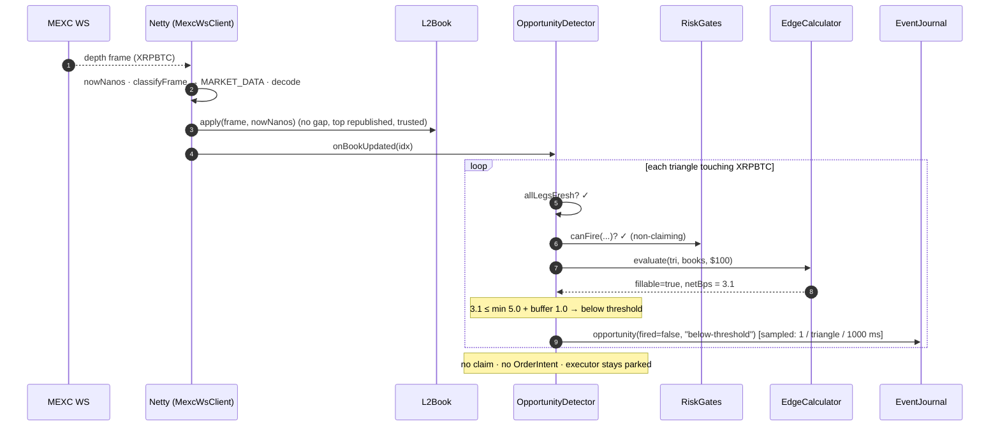

## Scenario 2 — an opportunity that succeeds (profit)

Same tick shape, but the walk comes back `netBps = 9.0` (> 6.0). Live mode.

1. Steps 1–6 as above, except `EdgeCalculator` returns `netBps = 9.0` and per-leg
   `legWorstPriceFixed[]` / `legBaseQtyFixed[]`.
2. **`riskGates.claim(triangleIndex, nowNanos)`** — stamps the cooldown slot, pushes the
   cycles/minute ring, `openCycles → 1`.
3. `OrderIntent` (+ two `long[3]` copies) allocated; `orderQueue.offer(intent)` succeeds;
   `recordOpportunityFired()`; `journal.write(opportunity(fired=true))` (not sampled).
4. **`cf-arb-executor`** polls the intent. `killSwitch.tripped()` → false.
   `age = now - detectedAtNanos = 40 ms ≤ 150 ms` → proceed. `dryRun=false` → `executeLive`.
5. **Leg 0** (`BTCUSDT:ASK`, BUY BTC with USDT): `inputAmountFixed = candidateNotional`
   ($100). `requestedBaseQtyFixed = legBaseQtyFixed[0]` verbatim.
   `reconciler.submitAndReconcile` → `POST /api/v3/order` returns `{orderId}` → `GET /api/v3/order`
   returns `status=FILLED, executedQty` → status terminal, no cancel → `GET /api/v3/myTrades` →
   commission in BTC. `classifyFill` → `FILLED`. `carryAmount = netProceeds(leg0)` = BTC received −
   commission.
6. **Leg 1** (`XRPBTC:ASK`, BUY XRP with BTC): `inputAmountFixed = carryAmount`.
   `quantizeLeg(ASK, XRPBTC, carryBTC, price)` → base qty + quote; both clear `minQty` /
   `minNotional`. Submit → reconcile → `FILLED`. `carryAmount = netProceeds(leg1)` = XRP received −
   commission.
7. **Leg 2** (`XRPUSDT:BID`, SELL XRP for USDT): same, `FILLED`. `finalAnchor = netProceeds(leg2)`
   = USDT received − commission.
8. `anchorSpent = leg0.executedQuoteFixed` (USDT actually spent on leg 0).
   `pnl = finalAnchor - anchorSpent` (positive). `portfolio.applyRealizedPnl(pnl)` →
   `killSwitch.recordSuccess()` (resets the consecutive-failure counter) →
   `killSwitch.checkEquityFloor()` → `metrics.recordCycleCompleted()` →
   `journal.write(cycle(...))` with realized PnL, equity after, duration.
9. `execute`'s `finally` → `riskGates.onCycleFinished()` (`openCycles → 0`) +
   `recordFullCycleNanos`.

*Dry-run variant:* steps 4→ `executePaper` instead — `signAndDiscardForLatencyMeasurement` builds
and signs 3 order payloads through the real code path and discards them (`.send()` is never
called), then credits `pnl = candidateNotional × (detectedNetBps / 10_000)` directly and journals
a `cycle`. No network, no `Unwinder`, no `CycleState`.

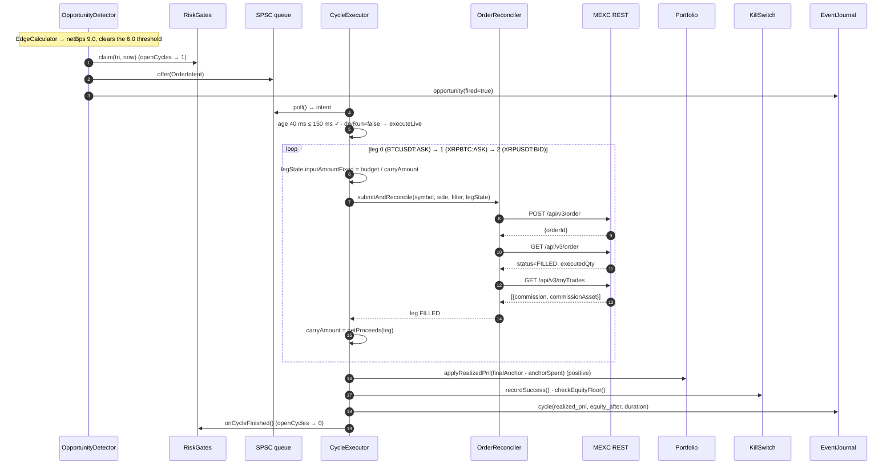

## Scenario 3 — an opportunity that fails (broken cycle + unwind)

Detector fires exactly as Scenario 2. Live mode. Leg 0 fills. **Leg 1 comes back `PARTIAL`** — the
book moved between detection and execution, and the IOC order at `legWorstPriceFixed[1]` filled
only ~60% of the intended XRP, consuming only ~60% of the BTC it was handed.

1. Leg 0 (`BTCUSDT:ASK`) → `FILLED`. `carryAmount = netProceeds(leg0)` (BTC in hand).
2. Leg 1 (`XRPBTC:ASK`): `legState.inputAmountFixed = carryAmount` (all the BTC).
   `submitAndReconcile` → `POST` ok → `GET /api/v3/order` → `status=PARTIALLY_FILLED` (non-terminal,
   not in the allowlist) → **`DELETE /api/v3/order`** (cancel) → **`GET /api/v3/order`** again →
   `status=CANCELED, executedQty` ≈ 60% → terminal. `classifyFill` → `0 < executed < requested` →
   **`PARTIAL`**. Commission fetched.
3. `executeLive` switch → `PARTIAL` → **`handleBrokenCycle(triangle, state, failedLeg=1,
   "partial-fill")`**. `metrics.recordCycleBroken()`.
4. **`Unwinder.unwind(triangle, state, 1)`**:
   - Held leg = **1** (`PARTIAL`). `working = netProceeds(leg1)` = XRP acquired (≈ 60% of target).
   - `i = 1`: `reverseSide = BID` (SELL XRP for BTC on `XRPBTC`).
     `priceReversal` — `XRPBTC` book is trusted and fresh (age < 5 s) → cross `topBid` down by 40
     bps, clamp inside `PERCENT_PRICE_BY_SIDE` (floor rounded up to a tick). `quantizeLeg` →
     base + quote clear the minimums. `submitAndReconcile` → `FILLED`.
     `lastReversalProceeds` = BTC recovered → `working`.
   - `i ≥ 1` → **`working += residualHeldBy(ASK, leg1)`** = `inputAmountFixed - cummulativeQuoteQty`
     = the ~40% of BTC leg 1 never spent. **Now `working` = recovered BTC + un-spent BTC.**
   - `i = 0`: `reverseSide = BID` (SELL BTC for USDT on `BTCUSDT`). Price off `BTCUSDT`'s current
     top, submit → `FILLED`. `working` = USDT = anchor. Leg 0 is *not* topped up with a residual
     (its from-asset is the anchor; `anchorSpent` already measures the real leg-0 spend).
   - Return `Result(recoveredAnchorFixed = working, unrecoverable = false, "reversed legs 1..0")`.
5. Back in `handleBrokenCycle`: `anchorSpent = leg0.executedQuoteFixed` (USDT spent on leg 0).
   `loss = recoveredAnchorFixed - anchorSpent` — **negative** (two reversals each paid the spread
   + taker fee). `portfolio.applyBrokenCyclePnl(loss)` → new equity.
6. `r.unrecoverable()` is false → **`killSwitch.recordFailure("partial-fill (leg 1,
   usdt-btc-xrp-fwd)")`** — consecutive-failure counter → 1 (trips at 3).
   `killSwitch.checkEquityFloor()`. `journal.write(broken_cycle(failed_leg=1, "partial-fill",
   loss_usd, equity_after))`.
7. `execute`'s `finally` → `riskGates.onCycleFinished()` (`openCycles → 0`).

**Other failure shapes:**
- **`ZERO_FILL` on leg 1** — identical, except held leg = **0**, so `Unwinder` reverses only leg 0
  (SELL the BTC back for USDT). `residualHeldBy` is not applied to leg 0.
- **`UNKNOWN` on any leg** (reconciliation could not establish a terminal state, or a cancel didn't
  clear the order) — **no unwind runs.** `killSwitch.recordUnrecoverableInventory(...)` trips
  **immediately**; `journal.write(broken_cycle(..., "reconciliation-unknown-operator-review-required",
  loss=0))`. Inventory is left exactly as-is for a human.
- **Unrecoverable** (`Unwinder` needs to reverse a leg on `ETHUSDC`/`SOLUSDC`/`XRPUSDC` but the
  book is stale/untrusted *and* the symbol advertises no `MARKET`) — `Result(unrecoverable=true)`
  → `recordUnrecoverableInventory` → immediate trip, position journalled as stranded.

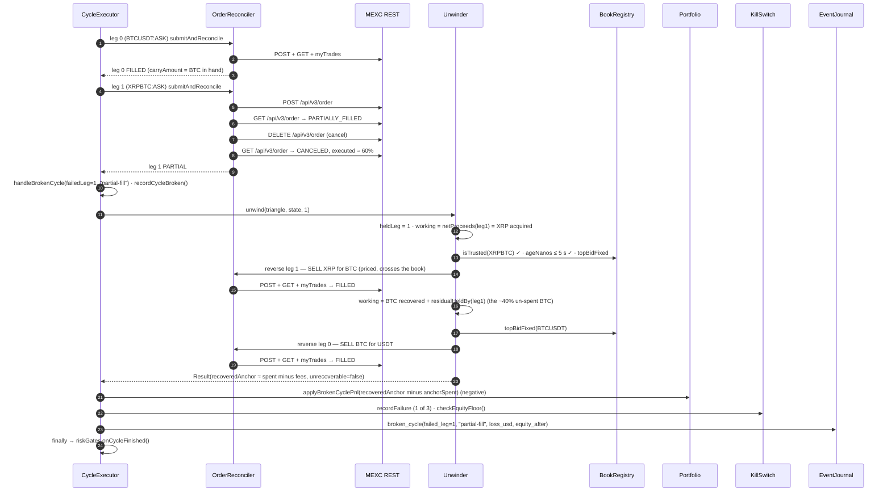

---

## Discrepancies & caveats found while writing this

None are bugs; they are places where a doc string or the README is looser than the code, or
genuinely unverified surface.

1. **`frameToDecision` histogram scope.** Measured across decode + `BookRegistry.applyFrame` only —
   stops *before* `OpportunityDetector.onBookUpdated`, starts *after* the `getBytes()` copy and
   `classifyFrame`. Not "wire arrival → fire decision". (Stage 1)
2. **Version-gap counting.** `L2Book.apply` returns a gap boolean "so the caller can count it";
   `BookRegistry.applyFrame` discards it and nothing counts gaps. The `reset()` still fires. (Stage 3)
3. **"One allocation" on fire.** `OpportunityDetector` allocates the `OrderIntent` plus two
   `long[3]` copies on the fire branch, not literally one object. Still only the rare branch. (Stage 4)
4. **`decisionToLeg1Ack` histogram is blended.** Recorded once per leg (all 3), each covering the
   full `place → query → cancel? → trades` round trip. Named as if it were just leg 1; per-stage
   split is an open Tier-3 item. (Stage 6, CLAUDE.md)
5. **Dry-run signs `type=LIMIT`.** The sign-and-discard latency path hard-codes `LIMIT`; a live
   order uses `IOC`. Signed bytes differ slightly; nothing is sent. (Stage 6)
6. **`IOC` and `quoteOrderQty` are both unverified against MEXC.** `exchangeInfo` never lists
   `IOC`/`FOK` for any symbol, and no credentialed request has exercised `quoteOrderQty` (used by
   `Unwinder`'s MARKET-BUY fallback). Both fail safe (a 4xx → `REJECTED_PRESUBMIT` /
   "stranded, operator review"); the 1-USDT live probe is the real gate before `dry-run=false`.
   (Stages 6, 8, CLAUDE.md)
7. **Reject journaling is sampled.** Several *distinct* opportunities on the same triangle inside
   `reject-sample-ms` (1000 ms) collapse to one `opportunity(fired=false)` line — only the first
   carries the detail; the rest are `cfarb.journal.suppressed++`. A session reconstructed purely
   from the NDJSON undercounts near-misses; the counter is the honest total. (Stage 4)
8. **`UserDataStream` is present but inert and unverified** — not wired into the fill path, listen
   key flow never probed live. (Side threads)
9. **No live balance reconciliation on boot** — `Portfolio` is a single in-memory number seeded
   from config; a restart does not fetch or reconcile the live account, and non-anchor inventory
   left by a prior `UNKNOWN`/stranded outcome is invisible to it. Required before any unattended
   live run. (CLAUDE.md known gaps)
10. **`terraform/`, the Tokyo RTT probe, and S3 journal sync have never run** — no AWS credentials
    in the environment that wrote them. (CLAUDE.md / README.md)
11. **`PERCENT_PRICE_BY_SIDE` reference price is unverified.** `Unwinder.clampToPriceBand` assumes
    the band is relative to the current top-of-book; whether MEXC uses that or a trailing average
    is still an open live-probe question. (Stage 8, CLAUDE.md)
12. **`FixedPoint.SCALE` clamps XRPBTC's price precision** (venue 9 decimals → 8). Now logged as a
    loud startup `WARN` (third pass) rather than clamped silently, but the potential edge-calc
    discrepancy on that symbol is still only settled by the credentialed probe. (Stage 0)
13. **No dedicated `OpportunityDetector` unit test.** Its gate ordering is exercised transitively
    (`RiskGatesTest`, `EdgeCalculatorTest`, `SizerTest`, `CycleExecutorTest` drives the
    SPSC→executor boundary, `BotServiceWatchdogTest` covers the watchdog state machine,
    `OrderReconcilerTest` the M4/M5/M6 fixes) — but nothing asserts the detector's own sequence of
    checks directly.
